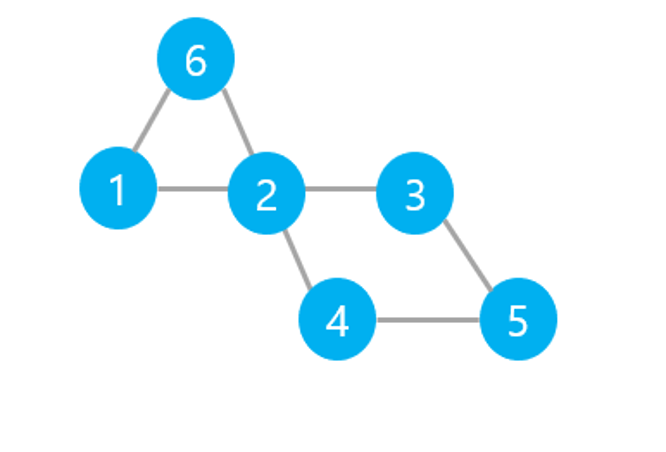

# 그래프 용어

- 정점(vertex)
- 노드(node)
- 간선(edge): 정점을 잇는 선
- 그래프(graph): 노드와 그들을 잇는 간선으로 이루어짐
- 이웃노드(neighbor), 인접한 노드(adjacent): 두 노드를 잇는 간선이 있을 때, 두 노드를 이웃노드라 함

# DFS(Depth-First Search)란?

깊이 우선 탐색이라고 부른다.  
루트 노드에서 시작하여 해당 노드의 자식 노드를 우선적으로 탐색  
스택 또는 재귀함수로 구현

# BFS(Breadth-First Search)란?

너비 우선 탐색이라고 부른다.  
루트 노드에서 시작하여 해당 노드의 인접 노드를 우선적으로 탐색한다.  
큐(Queue)로 구현

# 문제 유형

DFS 유형: 이동할 때마다 가중치가 있거나 이동 과정에서 여러 제약이 있는 경우  
BFS 유형: 단순한 최단 경로 찾는 문제

# 탐색 순서


DFS: 1, 2, 3, 5, 4, 6  
BFS: 1, 2, 6, 3, 4, 5

# c++ 구현

edge[1] = {2, 6}  
edge[2] = {1, 3, 4, 6}  
edge[3] = {2, 5}  
edge[4] = {2, 5}  
edge[5] = {3, 4}  
edge[6] = {1, 2}

=> <u>**DFS**</u>  
c(checked) 배열을 이용해 특정 노드를 방문했으면 그 노드를 방문했다고 체크한다.  
edge 벡터를 이용해 각 노드의 인접한 노드가 무엇인지 미리 main 함수에서 입력 받을 때 기록해둔다.

```c++
#include <cstdio>
#include <vector>
#include <queue>
#include <algorithm>
#include <iostream>
using namespace std;

bool c[10];
vector <int> edge[10];

void dfs(int x) {
  c[x] = 1;
  cout << now << "번 노드를 방문" << "\n";

  for (int i = 0; i < edge[now].size(); i++) {
    int next = edge[now][i];
    if (!c[next]) dfs(next);
  }
}
```

=> <u>**BFS**</u>  
현재 노드에서 아직 방문하지 않았고, 이웃한 노드를 push로 큐에 추가  
q.front()로 큐에서 가장 앞쪽에 있는 노드 찾고 방문 (현재 노드가 됨)  
방문 했으니 q.pop()으로 큐에서 삭제함

```c++
#include <cstdio>
#include <vector>
#include <queue>
#include <algorithm>
#include <iostream>
using namespace std;

bool c[10];
vector <int> edge[10];
queue <int> q;

void bfs(int x) {
	c[x] = 1;
	q.push(x);

	while (!q.empty()) {
		int now = q.front();
		q.pop();
		cout << now << "번 노드를 방문" << "\n";

		for (int i = 0; i < edge[now].size(); i++) {
			int next = edge[now][i];
			if (!c[next]) {
				c[next] = 1;
				q.push(next);
			}
		}
	}
}
```
