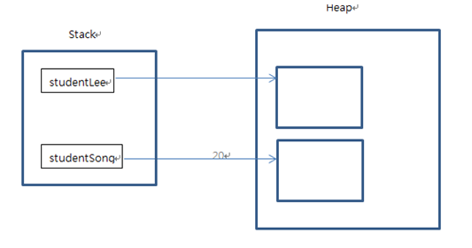

인스턴스 (instance) 힙 메모리 (heap memory)

## 인스턴스 (instance)

- 클래스는 객체의 속성을 정의하고, 기능을 구현하여 만들어 놓은 코드 상태
- 실제 클래스 기반으로 생성된 객체(인스턴스)는 각각 다른 멤버 변수 값을 가지게 됨
  - 가령, 학생의 클래스에서 생성된 각각의 인스턴스는 각각 다른 이름, 학번, 학년 등의 값을 가지게 됨
- new 키워드를 사용하여 인스턴스 생성

## 힙 메모리

- 생성된 인스턴스는 동적 메모리(heap memory)에 할당됨
- C나 C++언어에서는 사용한 동적 메모리를 프로그래머가 해제시켜야 함(free()는 delete 이용)
- 자바에서 Gabage Collector가 주기적으로 사용하지 않는 메모리를 수거
- 하나의 클래스로부터 여러개의 인스턴스가 생성되고 각각 다른 메모리 주소를 가지게 됨

## 용어 정리

- 객체: 객체 지향 프로그램의 대상, 생성된 인스턴스
- 클래스: 객체를 프로그래밍 하기 위해 코드로 정의해 놓은 상태
- 인스턴스: new 키워드를 사용하여 클래스를 메모리에 생성한 상태
- 멤버 변수: 클래스의 속성, 특성
- 메서드: 멤버 변수를 이용하여 클래스의 기능을 구현한 함수
- 참조 변수: 메모리에 생성된 인스턴스를 가리키는 변수
- 참조 값: 생성된 인스턴스의 메모리 주소 값
