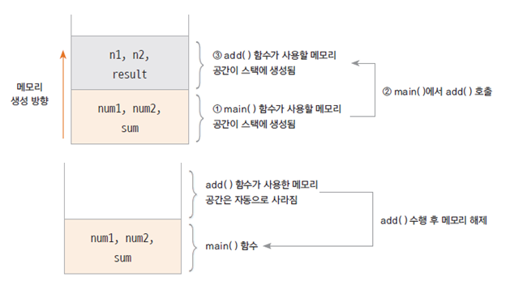

함수(function) 메서드(method)

## 함수란 (function)

- 하나의 기능을 수행하는 일련의 코드
- 구현된(정의된) 함수는 호출하여 사용하고 호출된 함수는 기능이 끝나면 제어가 반환됨
- 함수로 구현된 하나의 기능은 여러 곳에서 동일한 방식으로 호출되어 사용될 수 있음


## 함수 호출과 스택 메모리

- 스택: 함수가 호출될 때 지역 변수들이 사용하는 메모리
- 함수의 수행이 끝나면 자동으로 반환되는 메모리



## 메서드 (method)

- 객체의 기능을 구현하기 위해 클래스 내부에 구현되는 함수
- 멤버 함수 (member function)이라고도 함
- 메서드를 구현함으로써 객체의 기능이 구현 됨
- 메서드의 이름은 그 객체를 사용하는 객체(클라이언트)에 맞게 짓는것이 좋음
  - 예) getStudentName()

## 객체의 속성은 멤버 변수로, 객체의 기능은 메서드로 구현

- 학생 클래스의 속성을 멤버 변수로 선언하고 메서드를 구현한다.

```java
public class Student {

	public int studentID;
	public String studentName;
	public String address;

	public void showStudentInfo() {
		System.out.println(studentName + "," + address);
	}

	public String getStudentName() {
		return studentName;
	}
}

```

- 학생 클래스를 생성하여 생성된 객체(인스턴스)에 각각 다른 이름과 주소를 대입한다.

```java
public class StudentTest {

	public static void main(String[] args) {

		Student studentLee = new Student();
		studentLee.studentName = "이순신";
		studentLee.address = "서울";


		studentLee.showStudentInfo();

		Student studentKim = new Student();
		studentKim.studentName = "김유신";
		studentKim.address = "경주";

		studentKim.showStudentInfo();

		System.out.println(studentLee);
		System.out.println(studentKim);
	}

}

```
