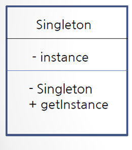

싱글톤 패턴이란? (singleton pattern)

## 싱글톤 패턴이란?

- 프로그램에서 인스턴스가 단 한 개만 생성되어야 하는 경우 사용하는 디자인 패턴
- static 변수, 메서드를 활용하여 구현할 수 있음

## 싱글톤 패턴으로 회사 객체 구현하기

- 클래스 내부에 유일한 private 인스턴스 생성  
  유일한 객체 Company

```java
private static Company instance = new Company();
```

- 생성자는 private으로 선언  
  Company를 마음대로 new 할 수 없도록

```java
private Company() {}
```

- 외부에서 유일한 인스턴스를 참조할 수 있는 public 메서드 제공

```java
public static Company getInstance() {

	if(instance == null) { // 방어 코드
		instance = new Company();
	}
	return instance;
}
```

CompanyTest.java

```java
//import java.util.Calendar;

public class CompanyTest {

	public static void main(String[] args) {
		// static일 경우 클래스 이름으로 가져와야 함
		Company company1 = Company.getInstance();
		Company company2 = Company.getInstance();

		System.out.println(company1);
		System.out.println(company2);

		//Calendar calendar = Calendar.getInstance();
	}
}
```

Singleton이라는 클래스 이름에 instance라는 private 멤버 변수가 하나 있고,  
Singleton이라는 생성자는 private이다. getInstance는 public으로 제공  
-> getInstance 가져다 쓰면 됨

-는 private  
+는 public



## 복습

자동차 공장이 있습니다. 자동차 공장은 유일한 객체이고, 이 공장에서 생산되는 자동차는 제작될 때마다 고유의 번호가 부여됩니다.  
자동차 번호가 10001부터 시작되어 자동차가 생산될 때마다 10002, 10003 이렇게 번호가 붙도록 자동차 공장 클래스, 자동차 클래스를 구현하세요  
다음 CarFactoryTest.java 테스트 코드가 수행 되도록 합니다.

CarFactoryTest.java

```java
public class CarFactoryTest {

	public static void main(String[] args) {
		CarFactory factory = CarFactory.getInstance();
		Car mySonata = factory.createCar();
		Car yourSonata = factory.createCar();

		System.out.println(mySonata.getCarNum());     //10001 출력
		System.out.println(yourSonata.getCarNum());   //10002 출력
	}
}

```

CarFactory.java

```java
public class CarFactory {
	// 클래스 내부에 유일한 private 인스턴스 생성
	private static CarFactory instance = new CarFactory();
	// 생성자는 private으로 선언 CarFactory를 마음대로 new 할 수 없도록
	private CarFactory() {}

	public static CarFactory getInstance() {
		if(instance == null) { // 방어 코드
			instance = new CarFactory();
		}
		return instance;
	}

	public Car createCar() {
		Car car = new Car();
		return car;
	}
}
```

Car.java

```java
public class Car {

	private static int serialNum = 10000;
	private int carNum;

	public Car() {
		serialNum++;
		carNum = serialNum;
	}

	public int getCarNum() {
		return carNum;
	}

	public void setCarNum(int carNum) {
		this.carNum = carNum;
	}
}

```
