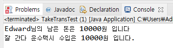

객체 지향 프로그래밍에서의 협력 (collabration)

## 객체 간의 협력 (collabration)

- 객체 지향 프로그램에서 객체 간에는 협력이 이루어짐
- 협력을 위해서는 필요한 메세지를 전송하고 이를 처리하는 기능이 구현되어야 함
- 매개 변수로 객체가 전달되는 경우가 발생
- 객체 협력의 예


## 버스 타고 학교 가는 학생의 과정

James와 Tomas는 각각 버스와 지하철을 타고 학교에 갑니다.
James는 5000원을 가지고 있었고, 100번 버스를 타면서 1000원을 지불합니다.
Tomas는 10000원을 가지고 있었고, 초록색 지하철을 타면서 1200원을 지불합니다.

두 학생이 버스와 지하철을 타는 상황을 구현해 봅시다.


Student.java

```java
public class Student {

	String studentName;
	int grade;
	int money;

	public Student(String studentName, int money) {
		this.studentName = studentName;
		this.money = money;
	}

	public void takeBus(Bus bus) {
		bus.take(1000);
		this.money -= 1000;
	}

	public void takeSubway(Subway subway) {
		subway.take(1200);
		this.money -= 1200;
	}

	public void showInfo() {
		System.out.println(studentName +"님의 남은 돈은 " + money + "원 입니다");
	}
}
```

Bus.java

```java
public class Bus {

	int busNumber;
	int passengerCount;
	int money;

	public Bus(int busNumber) {
		this.busNumber = busNumber;
	}

	public void take(int money) {  //승차
		this.money += money;
		passengerCount++;
	}

	public void showBusInfo() {
		System.out.println(busNumber + "번 버스의 승객은 " + passengerCount + "명 이고, 수입은 " + money + "원 입니다");
	}
}
```

Subway.java

```java
public class Subway {

	int lineNumber;
	int passengerCount;
	int money;

	public Subway(int lineNumber) {
		this.lineNumber = lineNumber;
	}

	public void take(int money) {
		this.money += money;
		passengerCount++;
	}

	public void showSubwayInfo() {
		System.out.println(lineNumber + "번 지하철의 승객은 " + passengerCount + "명 이고, 수입은 " + money + "원 입니다");
	}
}
```

TakeTransTest.java

```java
public class TakeTransTest {

	public static void main(String[] args) {
		Student studentJ = new Student("James", 5000);
		Student studentT = new Student("Tomas", 10000);

		Bus bus100 = new Bus(100);

		Subway subwayGreen = new Subway(2);


		studentJ.takeBus(bus100);
		studentT.takeSubway(subwayGreen);

		studentJ.showInfo();
		studentT.showInfo();

		bus100.showBusInfo();

		subwayGreen.showSubwayInfo();
	}
}
```

## 택시 타고 학교 가는 학생의 과정 (복습)

앞의 예제에서 Edward는 지각을 해서 택시를 타야 했습니다.  
20000원을 가지고 있었는데 10000원을 택시비로 사용했습니다.  
택시는 '잘나간다 운수' 회사 택시를 탔습니다.



Student.java

```java
public class Student {
	String name;
	int money;

	public Student(String name, int money) {
		this.name = name;
		this.money = money;
	}

	public void takeTaxi(Taxi taxi) {
		taxi.take(10000);
		this.money -= 10000;
	}

	public void showInfo() {
		System.out.println(name + "님의 남은 돈은 " + money + "원입니다.");
	}
}
```

Taxi.java

```java
public class Taxi {
	String taxiName;
	int money;

	public Taxi(String taxiName) {
		this.taxiName = taxiName;
	}

	public void take(int money) {
		this.money += money;
	}

	public void showTaxiInfo() {
		System.out.println(taxiName + " 수입은 " + money + "원입니다.");
	}
}
```

Test.java

```java
public class Test {
	public static void main(String[] args) {
		Student Edward = new Student("Edward", 20000);
		Taxi taxi = new Taxi("잘나간다 운수");

		Edward.takeTaxi(taxi);

		Edward.showInfo();
		taxi.showTaxiInfo();
	}
}
```
