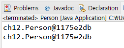

this가 하는일

## this가 하는 일

- 인스턴스 자신의 메모리를 가리킴
- 생성자에서 또 다른 생성자를 호출할 때 사용
- 자신의 주소(참조값)을 반환함

## 생성된 인스턴스 메모리의 주소를 가짐

- 클래스 내에서 참조변수가 가지는 주소 값과 동일한 주소 값을 가지는 키워드


```java
public void setYear(int year)
{
    this.year = year;
}
```

## 생성자에서 다른 생성자를 호출하는 this

- 클래스에 생성자가 여러 개인 경우, this를 이용하여 생성자에서 다른 생성자를 호출할 수 있음
- 생성자에서 다른 생성자를 호출하는 경우, 인스턴스의 생성이 완전하지 않은 상태이므로 this() statement 이전에 다른 statement를 쓸 수 없음

```java
public class Person {

	String name;
	int age;

	public Person() {
		this("이름없음", 1);
	}

	public Person(String name, int age) {
		this.name = name;
		this.age = age;
	}
}

```

## 자신의 주소를 반환하는 this

```java
public class Person {

	String name;
	int age;

	public Person() {
		this("이름없음", 1);
	}

	public Person(String name, int age) {
		this.name = name;
		this.age = age;
	}

	public Person getPerson() {
		return this;
	}


	public static void main(String[] args)
	{
		Person p = new Person();
		p.name = "James";
		p.age = 37;

		Person p2 = p.getPerson();
		System.out.println(p);
		System.out.println(p2);
	}
}

```


