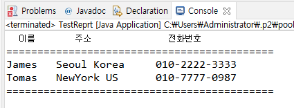

접근 제어 지시자 (access modifier)와 정보은닉 (infomation hiding)

## 접근 제어 지시자 (access modifier)

- 클래스 외부에서 클래스의 멤버 변수, 메서드, 생성자를 사용할 수 있는지 여부를 지정하는 키워드
- private: 같은 클래스 내부에서만 접근 가능(외부 클래스, 상속 관계의 클래스에서도 접근 불가)
- 아무것도 없음(default): 같은 패키지 내부에서만 접근 가능(상속 관계라도 패키지가 다르면 접근 불가)
- protected: 같은 패키지나 상속관계의 클래스에서 접근 가능하고 그 외 외부에서는 접근할 수 없음
- public: 클래스의 외부 어디서나 접근할 수 있음

## get()/set() 메서드

- private으로 선언된 멤버 변수(필드)에 대해 접근, 수정할 수 있는 메서드를 public으로 제공
- get() 메서드만 제공되는 경우 read-only 필드
- 이클립스에서 자동으로 생성됨

## 정보 은닉

- private으로 제어한 멤버 변수도 public 메서드가 제공되면 접근 가능하지만 변수가 public으로 공개되었을 때보다 private일때 각 변수에 대한 제한을 public 메서드에서 제어할 수 있다.

```java
public void setMonth(int month) {

		if ( month < 1 || month > 12) {
			isValid = false;
		}
		else {
			this.month = month;
		}
	}
```

- 객체 지향 프로그램에서 정보 은닉은 필요한 외부에서 접근 가능한 최소한의 정보를 오픈함으로써 **객체의 오류를 방지**해 클라이언트 객체가 더 효율적으로 객체를 활용할 수 있도록 해준다.

ex) date.month = 100;

## 정보 은닉을 활용한 캡슐화

- 꼭 필요한 정보와 기능만 외부에 오픈함
- 대부분의 멤버 변수와 메서드를 감추고 외부에 통합된 인터페이스만은 제공하여 일관된 기능을 구현하게 함
- 각각의 메서드나 멤버 변수를 접근함으로써 발생하는 오류를 최소화 한다.

## 레포트 만들기 예제

```java
public class MakeReport {

	StringBuffer buffer = new StringBuffer();

	private String line = "===========================================\n";
	private String title = "  이름\t   주소 \t\t  전화번호  \n";
	private void makeHeader()
	{
		buffer.append(line);
		buffer.append(title);
		buffer.append(line);
	}

	private void generateBody()
	{
		buffer.append("James \t");
		buffer.append("Seoul Korea \t");
		buffer.append("010-2222-3333\n");

		buffer.append("Tomas \t");
		buffer.append("NewYork US \t");
		buffer.append("010-7777-0987\n");
	}

	private void makeFooter()
	{

		buffer.append(line);
	}

	public String getReport()
	{
		makeHeader();
		generateBody();
		makeFooter();
		return buffer.toString();
	}
}

```

```java
public class TestReprt {

	public static void main(String[] args) {

		MakeReport report = new MakeReport();
		String builder = report.getReport();

		System.out.println(builder);
	}

}

```


