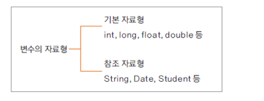

참조 자료형

## 참조 자료형

- 변수의 자료형
  

- 클래스형으로 변수를 선언
- 기본 자료형은 사용하는 메모리의 크기가 정해져 있지만, 참조 자료형은 클래스에 따라 다름
- 참조 자료형은 사용할 때는 해당 변수에 대해 생성해야 함
  - (String 클래스는 예외적으로 생성하지 않고 사용할 수 있음)

## 참조 자료형 정의하여 사용하기

- 학생이 수강한 과목들에 대한 성적을 산출하기 위한 경우 학생 클래스 속성에 과목이 모두 있으면 불합리
- 학생(Student)과 과목(Subject)에 대한 클래스를 분리하여 사용하고 Subject 클래스를 활용하여 수강한 과목들의 변수의 타입으로 선언


- 선언된 Subject 변수는 생성된 인스턴스가 아니므로, Student의 생성자에서 생성하여 사용

멤버변수의 참조 자료형을 만들어서 new 생성해서 써야한다.  
참조 자료형으로 분리를 하는 것이 각각 객체에 대한 역할과 기능을 분명하게 한다.

Student.java

```java
public class Student {

	int studentID;
	String studentName;

	Subject korea;
	Subject math;

	public Student(int id, String name) {
		studentID = id;
		studentName = name;

		korea = new Subject();
		math = new Subject();
	}

	public void setKoreaSubject(String name, int score) {
		korea.subjectName = name;
		korea.score = score;
	}

	public void setMathSubject(String name, int score) {
		math.subjectName = name;
		math.score = score;
	}

	public void showStudentSocre() {
		int total = korea.score + math.score;
		System.out.println(studentName +  " 학생의 총점은 " + total + "점입니다." );

	}
}

```

Subject.java

```java
public class Subject {
	String subjectName;
	int score;
	int subjectID;
}

```

StudentTest.java

```java
public class StudentTest {

    public static void main(String[] args) {

    	Student studentLee = new Student(100, "Lee");
    	studentLee.setKoreaSubject("국어", 100);
    	studentLee.setMathSubject("수학", 95);


    	Student studentKim = new Student(101, "Kim");
    	studentKim.setKoreaSubject("국어", 80);
    	studentKim.setMathSubject("수학", 99);

    	studentLee.showStudentSocre();
    	studentKim.showStudentSocre();
    }

}
```

**-> 결과**  
Lee 학생의 총점은 195점입니다.  
Kim 학생의 총점은 179점입니다.
