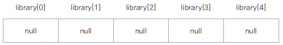

# 객체 배열 사용하기

## 객체 배열 선언과 구현

- 기본 자료형 배열은 선언과 동시에 배열의 크기만큼의 메모리가 할당되지만, 객체 배열의 경우엔 요소가 되는 객체의 주소가 들어갈(4바이트, 8바이트) 메모리만 할당되고(null) 각 요소 객체는 생성하여 저장해야함



Book.java

```java
public class Book {

	private String title;
	private String author;

	public Book() {}

	public Book(String title, String author) {
		this.title = title;
		this.author = author;
	}

	public String getTitle() {
		return title;
	}

	public void setTitle(String title) {
		this.title = title;
	}

	public String getAuthor() {
		return author;
	}

	public void setAuthor(String author) {
		this.author = author;
	}

	public void showBookInfo() {
		System.out.println(title + ", " +author);
	}
}

```

BookArrayTest.java

```java
public class BookArrayTest {

	public static void main(String[] args) {

		Book[] library = new Book[5];

		for(int i = 0; i < library.length; i++) {
			System.out.println(library[i]);
		}
	}
}

```


- 객체를 생성하여 각 배열의 요소로 저장하기

```java
public class BookArrayTest {

	public static void main(String[] args) {

		Book[] library = new Book[5];

		library[0] = new Book("태백산맥1", "조정래");
		library[1] = new Book("태백산맥2", "조정래");
		library[2] = new Book("태백산맥3", "조정래");
		library[3] = new Book("태백산맥4", "조정래");
		library[4] = new Book("태백산맥5", "조정래");

		for(int i = 0; i < library.length; i++) {
			System.out.println(library[i]);
			library[i].showBookInfo();
		}
	}
}

```


## 객체 배열 복사하기

- System.arrayCopy(src, srcPos, dest, destPos, length) 자바에서 제공되는 배열 복사 메서드

### 얕은 복사

객체 주소만 복사되어 한쪽 배열의 요소를 수정하면 같이 수정됨  
즉, 두 배열이 **같은 객체**를 가리킴

```java
public class ObjectCopy {

	public static void main(String[] args) {

		Book[] library = new Book[5];
		Book[] copyLibaray = new Book[5];

		library[0] = new Book("태백산맥1", "조정래");
		library[1] = new Book("태백산맥2", "조정래");
		library[2] = new Book("태백산맥3", "조정래");
		library[3] = new Book("태백산맥4", "조정래");
		library[4] = new Book("태백산맥5", "조정래");

		System.arraycopy(library, 0, copyLibaray, 0, 5);

		System.out.println("======copy library=========");
		for( Book book : copyLibaray ) {
			book.showBookInfo();
		}

		library[0].setTitle("나목");
		library[0].setAuthor("박완서");

		System.out.println("======library=========");
		for( Book book : library) {
			book.showBookInfo();
		}

		System.out.println("======copy library=========");

		for( Book book : copyLibaray) {
			book.showBookInfo();
		}
	}
}

```


### 깊은 복사

각각의 객체를 생성하여 그 객체의 값을 복사하여 배열이 서로 **다른 객체**를 가리키도록 함

```java
public class ObjectCopy2 {

	public static void main(String[] args) {

		Book[] library = new Book[5];
		Book[] copyLibaray = new Book[5];

		library[0] = new Book("태백산맥1", "조정래");
		library[1] = new Book("태백산맥2", "조정래");
		library[2] = new Book("태백산맥3", "조정래");
		library[3] = new Book("태백산맥4", "조정래");
		library[4] = new Book("태백산맥5", "조정래");

		copyLibaray[0] = new Book();
		copyLibaray[1] = new Book();
		copyLibaray[2] = new Book();
		copyLibaray[3] = new Book();
		copyLibaray[4] = new Book();

		for(int i = 0; i< library.length; i++) {
			copyLibaray[i].setTitle(library[i].getTitle());
			copyLibaray[i].setAuthor(library[i].getAuthor());
		}


		library[0].setTitle("나목");
		library[0].setAuthor("박완서");

		System.out.println("======library=========");
		for( Book book : library) {
			book.showBookInfo();
		}

		System.out.println("======copy library=========");
		for( Book book : copyLibaray) {
			book.showBookInfo();
		}
	}
}

```


# 2차원 배열 사용하기

## 다차원 배열

- 이차원 이상으로 구현된 배열
- 평면(이차원 배열)이나 공간(삼차원 배열)을 활용한 프로그램 구현

## 이차원 배열 예제


```java
public class TwoDimensionTest {

	public static void main(String[] args) {
		int[][] arr = { {1,2,3}, {4,5,6,7}};
		int i, j;

		for(i =0; i<arr.length; i++) {
			for(j=0; j<arr[i].length; j++) {
				System.out.print(arr[i][j] + " ");
			}
			System.out.println(", \t" + arr[i].length);
			System.out.println();
		}
	}
}

```


# 객체 배열을 구현한 클래스 ArrayList

## **java.util** 패키지에서 제공되는 ArrayList

- 기존의 배열 선언과 사용 방식은 배열의 길이를 정하고 요소의 개수가 배열의 길이보다 커지면 배열을 재할당하고 복사해야 했음
- 배열의 요소를 추가하거나 삭제하면 다른 요소들의 이동에 대한 구현을 해야함
- ArrayList는 객체 배열을 좀 더 효율적으로 관리하기 위해 자바에서 제공해주는 클래스
- 이미 많은 메서드들이 최적의 알고리즘으로 구현되어 있어 각 메서드의 사용 방법만 익히면 유용하게 사용할 수 있음

## ArrayList의 주요 메서드


## ArrayList를 활용한 간단한 예제

```java
import java.util.ArrayList;

public class ArrayListTest {

	public static void main(String[] args) {

		ArrayList<Book> library = new ArrayList<Book>();

		library.add(new Book("태백산맥1", "조정래"));
		library.add(new Book("태백산맥2", "조정래"));
		library.add(new Book("태백산맥3", "조정래"));
		library.add(new Book("태백산맥4", "조정래"));
		library.add(new Book("태백산맥5", "조정래"));

		for(int i =0; i < library.size(); i++) {
			library.get(i).showBookInfo();
		}
	}
}

```

## 간단한 성적 산출 프로그램

=> 예제 시나리오  
1001학번 Lee와 1002학번 Kim, 두 학생이 있습니다.  
Lee 학생은 국어와 수학 2과목을 수강했고, Kim 학생은 국어, 수학, 영어 3 과목을 수강하였습니다.  
Lee 학생은 국어 100점, 수학 50점입니다.  
Kim 학생은 국어 70점, 수학 85점, 영어 100점입니다.  
Student와 Subject 클래스를 만들고 ArrayList를 활용하여 두 학생의 과목 성적과 총점을 출력하세요


StudentTest.java

```java
public class StudentTest {

	public static void main(String[] args) {
		Student studentLee = new Student(1001, "Lee");

		studentLee.addSubject("국어", 100);
		studentLee.addSubject("수학", 50);

		Student studentKim = new Student(1002, "Kim");

		studentKim.addSubject("국어", 70);
		studentKim.addSubject("수학", 85);
		studentKim.addSubject("영어", 100);

		studentLee.showStudentInfo();
		System.out.println("======================================");
		studentKim.showStudentInfo();
	}

}

```

Subject.java

```java
public class Subject {
	private String name;
	private int score;

	public String getName() {
		return name;
	}
	public void setName(String name) {
		this.name = name;
	}
	public int getScore() {
		return score;
	}
	public void setScore(int score) {
		this.score = score;
	}
}

```

Student.javaa

```java
import java.util.ArrayList;

public class Student {
	int studentID;
	String studentName;

	ArrayList<Subject> subjectList;

	public Student(int studentID, String studentName) {
		this.studentID = studentID;
		this.studentName = studentName;

		subjectList = new ArrayList<Subject>();
	}

	public void addSubject(String name, int score) {
		Subject subject = new Subject();
		subject.setName(name);
		subject.setScore(score);

		subjectList.add(subject);
	}

	public void showStudentInfo() {

		int total = 0;

		for(Subject s : subjectList) {
			total += s.getScore();
			System.out.println("학생 " + studentName + "의 " + s.getName() + " 과목 성적은 " + s.getScore() + "입니다.");
		}
		System.out.println("학생 " + studentName + "의 총점은 " + total + "입니다.");

	}
}

```
