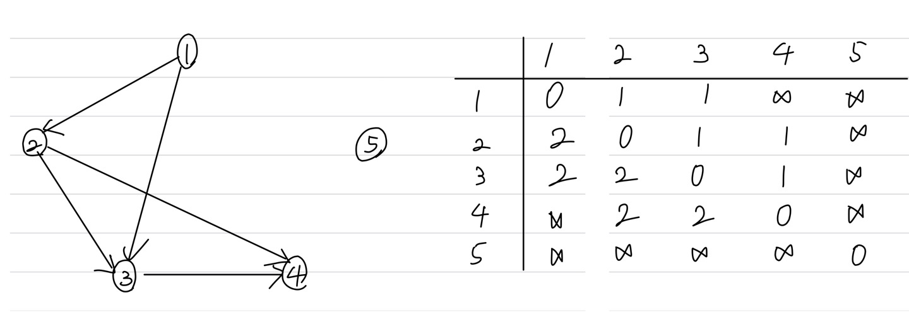

문제 링크 [https://www.acmicpc.net/problem/1613](https://www.acmicpc.net/problem/1613)

## 문제

역사, 그 중에서도 한국사에 해박한 세준이는 많은 역사적 사건들의 전후 관계를 잘 알고 있다. 즉, 임진왜란이 병자호란보다 먼저 일어났으며, 무오사화가 기묘사화보다 먼저 일어났다는 등의 지식을 알고 있는 것이다.

세준이가 알고 있는 일부 사건들의 전후 관계들이 주어질 때, 주어진 사건들의 전후 관계도 알 수 있을까? 이를 해결하는 프로그램을 작성해 보도록 하자.

## 입력

첫째 줄에 첫 줄에 사건의 개수 n(400 이하의 자연수)과 알고 있는 사건의 전후 관계의 개수 k(50,000 이하의 자연수)가 주어진다. 다음 k줄에는 전후 관계를 알고 있는 두 사건의 번호가 주어진다. 이는 앞에 있는 번호의 사건이 뒤에 있는 번호의 사건보다 먼저 일어났음을 의미한다. 물론 사건의 전후 관계가 모순인 경우는 없다. 다음에는 사건의 전후 관계를 알고 싶은 사건 쌍의 수 s(50,000 이하의 자연수)이 주어진다. 다음 s줄에는 각각 서로 다른 두 사건의 번호가 주어진다. 사건의 번호는 1보다 크거나 같고, N보다 작거나 같은 자연수이다.

## 출력

s줄에 걸쳐 물음에 답한다. 각 줄에 만일 앞에 있는 번호의 사건이 먼저 일어났으면 -1, 뒤에 있는 번호의 사건이 먼저 일어났으면 1, 어떤지 모르면(유추할 수 없으면) 0을 출력한다.

## 풀이 과정

예전에 풀었던 플로이드 와샬의 백준 키 순서와 비슷한 문제였다.  
키 순서 문제 링크 [https://www.acmicpc.net/problem/2458](https://www.acmicpc.net/problem/2458)

처음에 입력을 받자마자 num[x][y] = 1, num[y][x] = 2 값을 넣어주는데  
1은 앞에 있는 번호의 사건이 먼저 일어났다는 뜻이고,  
2는 뒤에 있는 번호의 사건이 먼저 일어났다는 뜻이다.

플로이드 와샬 함수의 num[i][k] == 1 && num[k][j] == 1 부분은
경유지를 거치면서 가는 길이 있다는 뜻이고, 사건의 전후 관계를 알 수 있다는 뜻이다. 그러므로, 시작 지점과 도착 지점에 1과 2를 넣어준다.  
만약 num[1][4]라면 k = 2, i = 1, j = 4이므로 num[1][4] = 1, num[4][1] = 2을 넣어줌으로써 1은 4보다 먼저 일어났고, 4는 1보다 늦게 일어났다는 것을 알 수 있다.

;
=> 플로이드 와샬 수행한 후  
.jpg>);

```c++
#include <vector>
#include <algorithm>
#include <iostream>
using namespace std;

int n, k, x, y, s, xs, ys;
int num[401][401];
const int INF = 1e9;

void floyd() {
	for (int k = 1; k <= n; k++) {
		for (int i = 1; i <= n; i++) {
			for (int j = 1; j <= n; j++) {
				if (num[i][k] == 1 && num[k][j] == 1) {
					num[i][j] = 1; // i가 j보다 먼저 일어난 사건
					num[j][i] = 2; // j가 i보다 먼저 일어난 사건
				}
			}
		}
	}
}

int main() {
	ios::sync_with_stdio(false);
	cin.tie(NULL); cout.tie(NULL);

	cin >> n >> k;
	for (int i = 1; i <= n; i++) {
		for (int j = 1; j <= n; j++) {
			if (i != j) num[i][j] = INF;
		}
	}
	for (int i = 0; i < k; i++) {
		cin >> x >> y;
		num[x][y] = 1; // x가 y보다 먼저 일어난 사건
		num[y][x] = 2; // y가 x보다 먼저 일어난 사건
	}
	floyd();

	cin >> s;
	for (int i = 0; i < s; i++) {
		cin >> xs >> ys;
		if (num[xs][ys] == 1) cout << -1;
		else if (num[xs][ys] == 2) cout << 1;
		else cout << 0; // num[xs][ys] == INF
		cout << "\n";
	}
}
```
