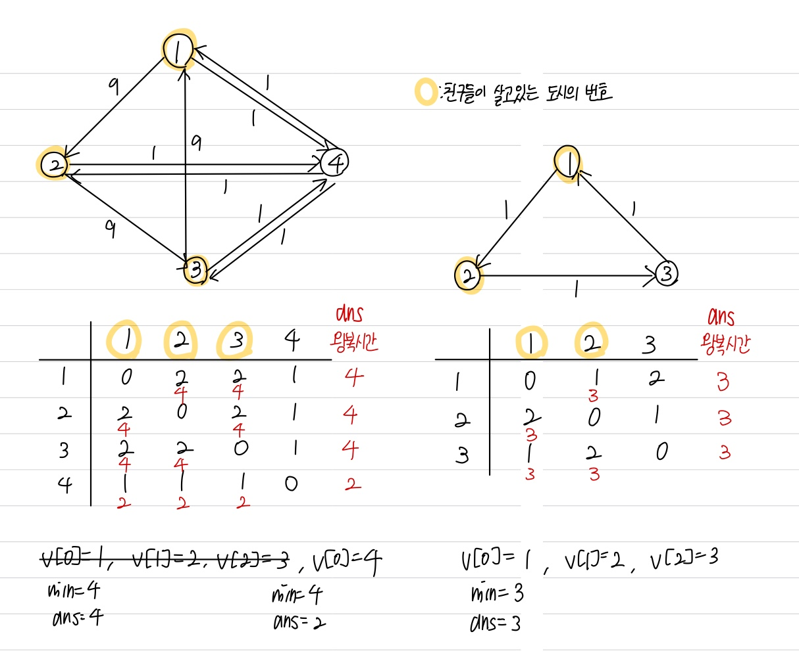

문제 링크 [https://www.acmicpc.net/problem/21940](https://www.acmicpc.net/problem/21940)

## 문제

준형이는 내일 친구들을 만나기로 했다. 준형이와 친구들은 서로 다른 도시에 살고 있다.

도시를 연결하는 도로는 일방 통행만 있어서 도시 $A_{i}$에서 도시 $B_{i}$로 가는 시간과 도시 $B_{i}$에서 도시 $A_{i}$로 가는 시간이 다를 수 있다.

준형이와 친구들은 아래 조건을 만족하는 도시 $X$를 선택하여 거기서 만나려고 한다.

- 왕복시간은 자신이 살고 있는 도시에서 도시 $X$로 이동하는 시간과 도시 $X$에서 다시 자신이 살고 있는 도시로 이동하는 시간을 합한 것이다.
- 준형이와 친구들이 도로를 이용하여 갈 수 있는 도시만 선택한다.
  준형이와 친구들의 왕복시간 들 중 최대가 최소가 되는 도시 $X$를 선택한다.
- 준형이와 친구들이 이동할 수 있는 도시가 최소한 하나 이상이 있음을 보장한다.
- 도시가 많다보니 계산하기 힘들다. 준형이와 친구들을 대신하여 도시 $X$를 알려주자.

## 입력

첫 번째 줄에는 도시의 개수 $N$과 도로의 개수 $M$이 주어진다.

두 번째 줄부터 M + 1줄까지 도시 $A_{i}$, 도시 $B_{i}$, 도시 $A_{i}$에서 도시 $B_{i}$로 이동하는데 걸리는 시간 $T_{i}$가 공백으로 구분되어 주어진다.

M + 2줄에는 준형이와 친구들의 총 인원 K가 주어진다.

M + 3줄에는 준형이와 친구들이 살고 있는 도시의 번호 $C_{i}$가 공백으로 구분되어 주어진다.

## 출력

위 조건을 만족하는 도시 X의 번호를 출력한다. 만약 가능한 도시 X가 여러 개인 경우는 도시의 번호를 오름차순으로 출력한다.

## 풀이 과정



```c++
#include <vector>
#include <algorithm>
#include <iostream>
using namespace std;

int N, M, a, b, t, K, city[201];
int num[201][201];
const int INF = 1e9;

void floyd() {
	for (int k = 1; k <= N; k++) {
		for (int i = 1; i <= N; i++) {
			for (int j = 1; j <= N; j++) {
				if (num[i][j] > num[i][k] + num[k][j]) {
					num[i][j] = num[i][k] + num[k][j];
				}
			}
		}
	}
}

int main() {
	ios::sync_with_stdio(false);
	cin.tie(NULL); cout.tie(NULL);

	cin >> N >> M;
	for (int i = 1; i <= N; i++) {
		for (int j = 1; j <= N; j++) {
			if (i != j) num[i][j] = INF;
		}
	}
	for (int i = 0; i < M; i++) {
		cin >> a >> b >> t;
		num[a][b] = t;
	}
	cin >> K;
	for (int i = 1; i <= K; i++) {
		cin >> city[i];
	}
	floyd();

	int min = INF;
	vector <int> v;
	for (int i = 1; i <= N; i++) {
		int ans = 0;
		for (int j = 1; j <= K; j++) {
			if (num[i][city[j]] != INF && num[city[j]][i] != INF) {
				ans = max(num[i][city[j]] + num[city[j]][i], ans);
			}
		}
		if (min > ans) {
			v.clear();
			v.push_back(i);
			min = ans;
		}
		else if (min == ans) {
			v.push_back(i);
		}
	}

	sort(v.begin(), v.end());
	for (int i = 0; i < v.size(); i++) {
		cout << v[i] << " ";
	}
}
```
