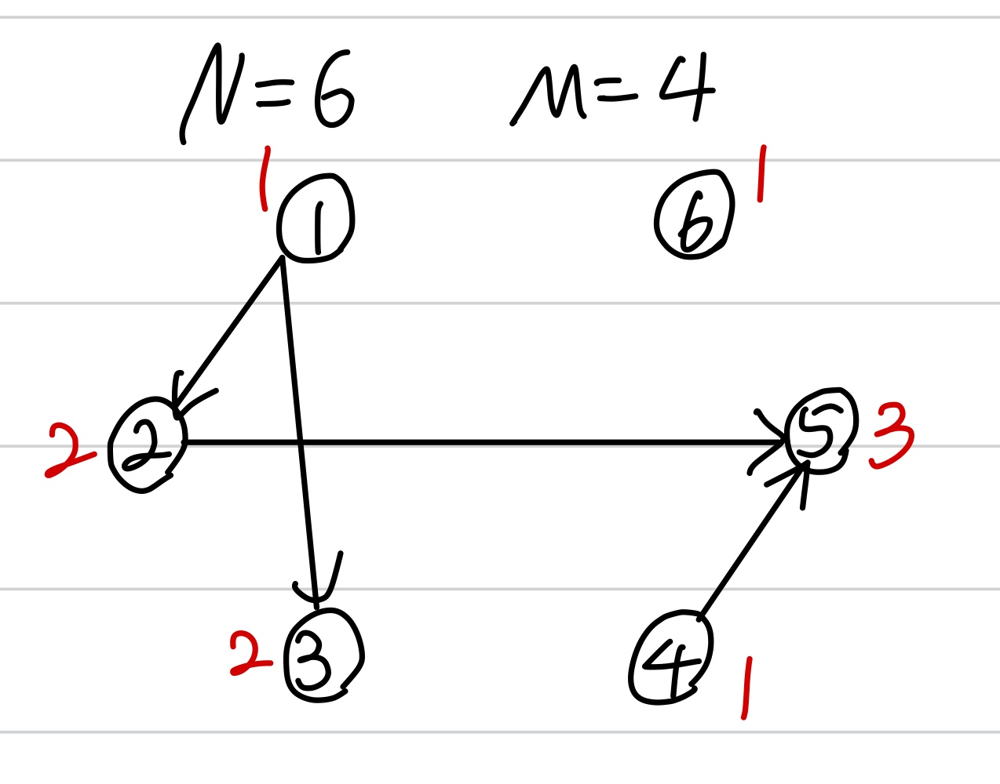

문제 링크 [https://www.acmicpc.net/problem/14567](https://www.acmicpc.net/problem/14567)

## 문제

올해 Z대학 컴퓨터공학부에 새로 입학한 민욱이는 학부에 개설된 모든 전공과목을 듣고 졸업하려는 원대한 목표를 세웠다. 어떤 과목들은 선수과목이 있어 해당되는 모든 과목을 먼저 이수해야만 해당 과목을 이수할 수 있게 되어 있다. 공학인증을 포기할 수 없는 불쌍한 민욱이는 선수과목 조건을 반드시 지켜야만 한다. 민욱이는 선수과목 조건을 지킬 경우 각각의 전공과목을 언제 이수할 수 있는지 궁금해졌다. 계산을 편리하게 하기 위해 아래와 같이 조건을 간소화하여 계산하기로 하였다.

한 학기에 들을 수 있는 과목 수에는 제한이 없다.
모든 과목은 매 학기 항상 개설된다.
모든 과목에 대해 각 과목을 이수하려면 최소 몇 학기가 걸리는지 계산하는 프로그램을 작성하여라.

## 입력

첫 번째 줄에 과목의 수 N(1≤N≤1000)과 선수 조건의 수 M(0≤M≤500000)이 주어진다. 선수과목 조건은 M개의 줄에 걸쳐 한 줄에 정수 A B 형태로 주어진다. A번 과목이 B번 과목의 선수과목이다. A < B인 입력만 주어진다. (1 ≤ A < B ≤ N)

## 출력

1번 과목부터 N번 과목까지 차례대로 최소 몇 학기에 이수할 수 있는지를 한 줄에 공백으로 구분하여 출력한다.

## 풀이 과정

dp와 위상정렬을 같이 쓰는 문제다.  
위상정렬 함수를 보면 진입차수가 0일 경우(1,4,6번 노드)에 큐에 푸시를 하며 정답 배열에 1을 넣어준다.  
그리고 큐가 비어있지 않을 때까지 연결되어있는 노드를 돌며 dp를 해주며 최종적으로 max인 값(res)를 출력해준다.

{: width="300" height="100"}

```c++
#include <vector>
#include <algorithm>
#include <iostream>
#include <cstring>
#include <stack>
#include <queue>
#include <cmath>
#define _CRT_SECURE_NO_WARNINGS
#pragma warning(disable : 4996)
using namespace std;

int N, M, A, B;
int indegree[1001]; // 진입차수
int res[1001]; // dp

queue <int> q;
vector <int> v[1001];

void topologySort() {
	for (int i = 1; i <= N; i++) {
		if (indegree[i] == 0) {
			q.push(i);
			res[i] = 1;
		}
	}

	while (!q.empty()) {
		int now = q.front();
		q.pop();

		for (int i = 0; i < v[now].size(); i++) {
			int next = v[now][i];
			indegree[next]--;

			res[next] = max(res[next], res[now] + 1);
			if (indegree[next] == 0) {
				q.push(next);
			}
		}
	}
}

int main() {
	ios::sync_with_stdio(false);
	cin.tie(NULL); cout.tie(NULL);

	cin >> N >> M;
	for (int i = 0; i < M; i++) {
		cin >> A >> B;
		v[A].push_back(B);
		indegree[B]++;
	}

	topologySort();
	for (int i = 1; i <= N; i++) {
		cout << res[i] << " ";
	}
}
```
