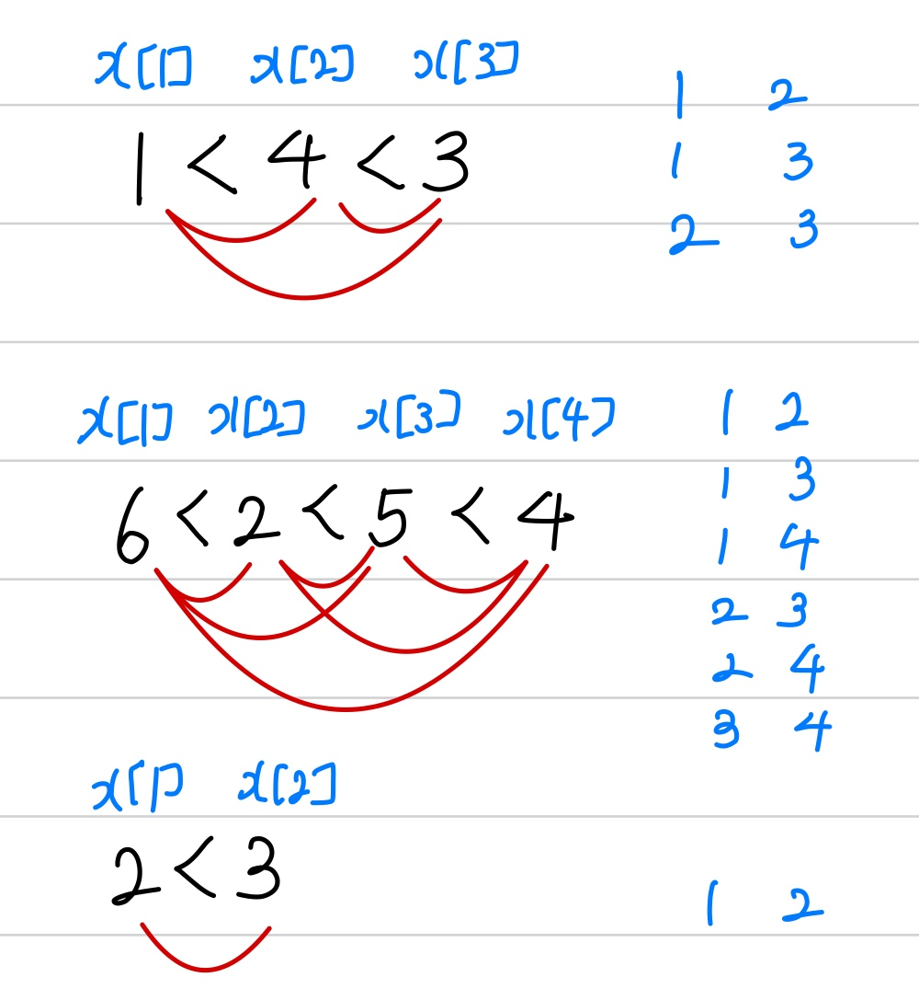

문제 링크 [https://www.acmicpc.net/problem/2623](https://www.acmicpc.net/problem/2623)

## 문제

인터넷 방송 KOI(Korea Open Internet)의 음악 프로그램 PD인 남일이는 자기가 맡은 프로그램 '뮤직 KOI'에서 가수의 출연 순서를 정하는 일을 매우 골치 아파한다. 순서를 정하기 위해서는 많은 조건을 따져야 한다.

그래서 오늘 출연 예정인 여섯 팀의 가수에 대해서 남일이가 보조 PD 세 명에게 각자 담당한 가수의 출연 순서를 정해오게 하였다. 보조 PD들이 가져온 것은 아래와 같다.

- 1 4 3
- 6 2 5 4
- 2 3

첫 번째 보조 PD는 1번 가수가 먼저, 다음에 4번 가수, 다음에 3번 가수가 출연하기로 순서를 정했다. 두 번째 보조 PD는 6번, 2번, 5번, 4번 순으로 자기 담당 가수들의 순서를 정했다. 한 가수를 여러 보조 PD가 담당할 수도 있다. 마지막으로, 세 번째 보조 PD는 2번 먼저, 다음에 3번으로 정했다.

남일이가 할 일은 이 순서들을 모아서 전체 가수의 순서를 정하는 것이다. 남일이는 잠시 생각을 하더니 6 2 1 5 4 3으로 순서를 정했다. 이렇게 가수 순서를 정하면 세 보조 PD가 정해온 순서를 모두 만족한다. 물론, 1 6 2 5 4 3으로 전체 순서를 정해도 괜찮다.

경우에 따라서 남일이가 모두를 만족하는 순서를 정하는 것이 불가능할 수도 있다. 예를 들어, 세 번째 보조 PD가 순서를 2 3 대신에 3 2로 정해오면 남일이가 전체 순서를 정하는 것이 불가능하다. 이번에 남일이는 우리 나라의 월드컵 4강 진출 기념 음악제의 PD를 맡게 되었는데, 출연 가수가 아주 많다. 이제 여러분이 해야 할 일은 보조 PD들이 가져 온 순서들을 보고 남일이가 가수 출연 순서를 정할 수 있도록 도와 주는 일이다.

보조 PD들이 만든 순서들이 입력으로 주어질 때, 전체 가수의 순서를 정하는 프로그램을 작성하시오.

## 입력

첫째 줄에는 가수의 수 N과 보조 PD의 수 M이 주어진다. 가수는 번호 1, 2,…,N 으로 표시한다. 둘째 줄부터 각 보조 PD가 정한 순서들이 한 줄에 하나씩 나온다. 각 줄의 맨 앞에는 보조 PD가 담당한 가수의 수가 나오고, 그 뒤로는 그 가수들의 순서가 나온다. N은 1이상 1,000이하의 정수이고, M은 1이상 100이하의 정수이다.

## 출력

출력은 N 개의 줄로 이뤄지며, 한 줄에 하나의 번호를 출력한 다. 이들은 남일이가 정한 가수들의 출연 순서를 나타낸다. 답이 여럿일 경우에는 아무거나 하나를 출력 한다. 만약 남일이가 순서를 정하는 것이 불가능할 경우에는 첫째 줄에 0을 출력한다.

## 풀이 과정

위상정렬 함수는 다른 문제와 동일하지만,  
입력을 받고 벡터 함수에 넣는 것이 색다른 문제였다.

{: width="300" height="400"}

위 사진처럼 수를 입력 받고, 부등호에 따라 이중 반복문으로  
벡터 함수에 넣어주며 진입차수를 1씩 늘려주었다.

큐의 앞부분 now의 값을 res에 넣어주며 개수가 N개가 아닐 때는  
순서를 정하는 것이 불가능하다는 뜻이므로 0을 출력해준다.

```c++
#include <vector>
#include <algorithm>
#include <iostream>
#include <queue>
using namespace std;

int N, M, Mnum, x[1001];
int indegree[1001];

queue <int> q;
vector <int> v[1001];
vector <int> res;

void topologySort() {
	for (int i = 1; i <= N; i++) {
		if (indegree[i] == 0) {
			q.push(i);
		}
	}
	while (!q.empty()) {
		int now = q.front();
		q.pop();
		res.push_back(now);

		for (int i = 0; i < v[now].size(); i++) {
			int next = v[now][i];
			indegree[next]--;

			if (indegree[next] == 0) {
				q.push(next);
			}
		}
	}
}

int main() {
	ios::sync_with_stdio(false);
	cin.tie(NULL); cout.tie(NULL);

	cin >> N >> M;
	for (int i = 0; i < M; i++) {
		cin >> Mnum;
		for (int j = 1; j <= Mnum; j++) {
			cin >> x[j];
		}
		for (int j = 1; j < Mnum; j++) {
			for (int k = j + 1; k <= Mnum; k++) {
				v[x[j]].push_back(x[k]);
				indegree[x[k]]++;
			}
		}
		memset(x, 0, sizeof(x));
	}
	topologySort();

	if (res.size() == N) { // 순서를 정하는 것이 가능할 때
		for (int i = 0; i < N; i++) {
			cout << res[i] << "\n";
		}
	}
	else cout << 0; // 불가능할 때
}
```
