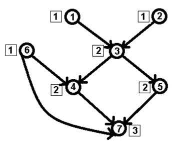

문제 링크 [https://www.acmicpc.net/problem/9470](https://www.acmicpc.net/problem/9470)

## 문제

지질학에서 하천계는 유향그래프로 나타낼 수 있다. 강은 간선으로 나타내며, 물이 흐르는 방향이 간선의 방향이 된다. 노드는 호수나 샘처럼 강이 시작하는 곳, 강이 합쳐지거나 나누어지는 곳, 바다와 만나는 곳이다.



네모 안의 숫자는 순서를 나타내고, 동그라미 안의 숫자는 노드 번호를 나타낸다.

하천계의 Strahler 순서는 다음과 같이 구할 수 있다.

- 강의 근원인 노드의 순서는 1이다.
- 나머지 노드는 그 노드로 들어오는 강의 순서 중 가장 큰 값을 i라고 했을 때, 들어오는 모든 강 중에서 Strahler 순서가 i인 강이 1개이면 순서는 i, 2개 이상이면 순서는 i+1이다.

하천계의 순서는 바다와 만나는 노드의 순서와 같다. 바다와 만나는 노드는 항상 1개이며, 위의 그림의 Strahler 순서는 3이다.

하천계의 정보가 주어졌을 때, Strahler 순서를 구하는 프로그램을 작성하시오.

실제 강 중에서 Strahler 순서가 가장 큰 강은 아마존 강(12)이며, 미국에서 가장 큰 값을 갖는 강은 미시시피 강(10)이다.

노드 M은 항상 바다와 만나는 노드이다.

## 입력

첫째 줄에 테스트 케이스의 수 T (1 ≤ T ≤ 1000)가 주어진다.

각 테스트 케이스의 첫째 줄에는 K, M, P가 주어진다. K는 테스트 케이스 번호, M은 노드의 수, P는 간선의 수이다. (2 ≤ M ≤ 1000) 다음 P개 줄에는 간선의 정보를 나타내는 A, B가 주어지며, A에서 B로 물이 흐른다는 뜻이다. (1 ≤ A, B ≤ M) M은 항상 바다와 만나는 노드이며, 밖으로 향하는 간선은 존재하지 않는다.

## 출력

각 테스트 케이스마다 테스트 케이스 번호와 입력으로 주어진 하천계의 Strahler 순서를 한 줄에 하나씩 출력한다.

## 풀이 과정

문제를 잘 읽지 않고 풀어서 고생했던 문제이다...

가장 핵심인 부분은 "나머지 노드는 그 노드로 들어오는 강의 순서 중 가장 큰 값을 i라고 했을 때, 들어오는 모든 강 중에서 Strahler 순서가 i인 강이 1개이면 순서는 i, 2개 이상이면 순서는 i+1이다"라는 부분이다.

.jpg>){: width="700" height="400"}

```c++
#include <vector>
#include <algorithm>
#include <iostream>
#include <queue>
using namespace std;

int T, K, M, P, A, B;
int indegree[1001];
int res[1001];

queue <int> q;
vector <int> v[1001];

void topologySort() {
	for (int i = 1; i <= M; i++) {
		if (indegree[i] == 0) {
			q.push(i);
			res[i] = 1; // 진입차수가 0이면 순서는 1
		}
	}

	vector <int> num[1001];

	while (!q.empty()) {
		int now = q.front();
		q.pop();

		for (int i = 0; i < v[now].size(); i++) {
			int next = v[now][i];
			indegree[next]--;
			num[next].push_back(res[now]); // 현재 노드의 순서 push

			int mnum = 0;
			if (indegree[next] == 0) {
				q.push(next);

				for (int i = 0; i < num[next].size(); i++) {
					mnum = max(mnum, num[next][i]);
				}
				int cnt = 0;
				for (int i = 0; i < num[next].size(); i++) {
					if (mnum == num[next][i]) cnt++;
				}
				// 순서가 i인 강이 1개이면 순서는 i
				if (cnt == 1) res[next] = res[now];
				// 순서가 i인 강이 2개 이상이면 순서는 i + 1
				else if (cnt > 1) res[next] = mnum + 1;
			}
		}
	}
}

int main() {
	ios::sync_with_stdio(false);
	cin.tie(NULL); cout.tie(NULL);

	cin >> T;
	while (T--) {
		cin >> K >> M >> P;
		for (int i = 0; i < P; i++) {
			cin >> A >> B;
			v[A].push_back(B);
			indegree[B]++;
		}
		topologySort();

		cout << K << " ";
		int ans = 0;
		for (int i = 1; i <= M; i++) {
			ans = max(ans, res[i]);
		}
		cout << ans << "\n";

		//testcase 수행을 위한 초기화
		memset(indegree, 0, sizeof(indegree));
		memset(v, 0, sizeof(v));
		memset(res, 0, sizeof(res));
	}
}
```
