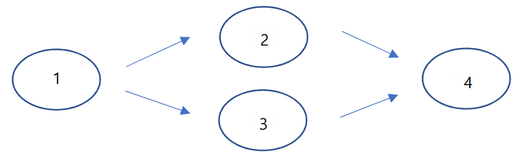

문제 링크 [https://www.acmicpc.net/problem/14676](https://www.acmicpc.net/problem/14676)

## 문제

영선이와 영우는 최근 ‘우주전쟁’ 이라는 게임을 시작했다. ‘우주전쟁’은 1대1로 하는 RTS(실시간 전략 게임) 게임으로, 각 플레이어는 건물을 건설하고, 건물에서 유닛을 생성하여 싸운다. ‘우주전쟁’은 건물을 짓는 순서가 정해져 있는데, 예를 들어 건물들이 다음과 같은 관계도를 가진다고 할 때,


2, 3번 건물은 반드시 1번 건물이 건설된 상태여야 지어질 수 있고, 4번 건물은 반드시 2, 3번 건물이 건설된 상태여야 지어질 수 있다. 단 4번 건물은 1번 건물과는 직접적인 연관이 없기 때문에 1번 건물이 없다고 하더 라도 4번 건물은 건설이 가능하다. 이때 1번 건물은 2, 3번 건물에 영향을 미친다고 할 수 있고, 2, 3번 건물은 4번 건물에 영향을 미친다고 할 수 있다. 또한 모든 건물들은 중복 건설이 가능하다. ‘우주전쟁’ 게임의 제작사 인 ‘얼음폭풍’사는 게임의 밸런스를 유지하기 위해 한 건물은 최대 3개의 건물에게만 영향을 미치도록 하였다. 또 ‘우주전쟁’ 게임에는 치트키가 하나 있는데, 이 치트키를 사용하면 원하는 건물을 마음대로 설치할 수 있다. 하지만 이 치트키를 사용하면 너무나 쉽게 게임에서 이길 수 있기 때문에 영선이와 영우는 서로 치트키를 쓰 지 않기로 약속했다. 하지만 이상하게도 영우는 영선이와의 게임에서 모두 승리하였고, 그런 영우를 이상하게 여긴 영선이는 영우의 건물 건설/파괴 정보를 가져왔다. (치트키로 건설한 건물은 건설 정보에 들어가지 않는 다.) 영우의 게임정보를 보고 영우가 치트키를 사용했는지 판단하는 프로그램을 만들어 영선이를 도와주자.

## 입력

프로그램의 입력은 표준 입력으로 받는다. 입력의 첫 줄에는 건물 종류의 개수 N, 건물 사이 관계의 개수 M, 영우의 게임 정보의 개수 K가 주어진다.(1 ≤ N, M, K ≤ 100,000) 다음 줄부터 M줄에 걸쳐 건물의 관계인 X Y 가 차례대로 중복 없이 주어진다. (X를 건설해야 Y를 건설할 수 있음.) (1 ≤ X, Y ≤ N) 다음 줄부터 K줄에 걸쳐 영우의 게임 정보가 다음과 같이 주어진다. (1 ≤ a ≤ N)

- 1 a(영우가 a번 건물을 1개 건설함)
- 2 a(영우의 a번 건물이 1개 파괴됨)

## 출력

프로그램의 출력은 표준 출력으로 한다. 영우가 정상적으로 건물을 건설하거나, 건설한 만큼의 건물만 파괴되 었다면 ‘King-God-Emperor’를. 건설할 수 없는 건물을 건설하거나, 건설한적 없는 건물이 파괴되었다면 ‘Lier!’ 를 출력하자.

## 풀이 과정

이때까지 풀었던 문제 유형들과는 다른 느낌이었다.  
위상정렬 함수를 만들지 않고 main함수 안에서 하려고 하니 더 어렵게 느껴졌다.

일단 입력을 M번 받아놓고 화살표 간선끼리 연결해주며 진입차수도 플러스해준다.  
그 다음, K번 반복하는 부분이 중요한데 option이 1이면 건물을 1개 건설하는 것이고 2이면 파괴하는 것이라고 한다.

건설 부분을 보면 진입차수가 0이여만 construct가 가능하다. 1번 노드를 건설했으니 next 2번, 3번 노드도 건설 가능하도록 진입차수를 -1씩 해준다. 만약에 진입차수가 0이 아닌데 건설을 하려고 한다면 건설할 수 없는 건물을 건설한다는 뜻이므로 check를 true로 바꿔준다.

파괴 부분을 보면 건설한 construct가 1개 이상이여야만 가능하다. 파괴를 하므로 construct를 -1씩 해준다. construct가 0이면 건물이 모두 파괴되었다는 뜻이므로 다음 노드를 지을 수 없기 때문에 다음 노드의 진입차수를 +1해준다.(진입차수가 0이여야만 construct가 가능하기 때문)

```c++
#include <vector>
#include <algorithm>
#include <iostream>
#include <string>
#include <stack>
#include <queue>
#include <cmath>
#define _CRT_SECURE_NO_WARNINGS
#pragma warning(disable : 4996)
using namespace std;

int N, M, K, x, y, option, a;
int indegree[100001], construct[100001];
bool check;

vector <int> v[100001];

int main() {
	ios::sync_with_stdio(false);
	cin.tie(NULL); cout.tie(NULL);

	cin >> N >> M >> K;
	for (int i = 0; i < M; i++) {
		cin >> x >> y;
		v[x].push_back(y);
		indegree[y]++;
	}
	for (int i = 0; i < K; i++) {
		cin >> option >> a;
		if (option == 1) { // 건설
			if (indegree[a] == 0) {
				construct[a]++;
				if (construct[a] == 1) {
					for (int j = 0; j < v[a].size(); j++) {
						int next = v[a][j];
						indegree[next]--;
					}
				}
			}
			else check = true;
		}
		else if (option == 2) { // 파괴
			if (construct[a] > 0) {
				construct[a]--;
				if (construct[a] == 0) {
					for (int j = 0; j < v[a].size(); j++) {
						int next = v[a][j];
						indegree[next]++;
					}
				}
			}
			else check = true;
		}
	}

	if (check) cout << "Lier!";
	else cout << "King-God-Emperor";
}
```
