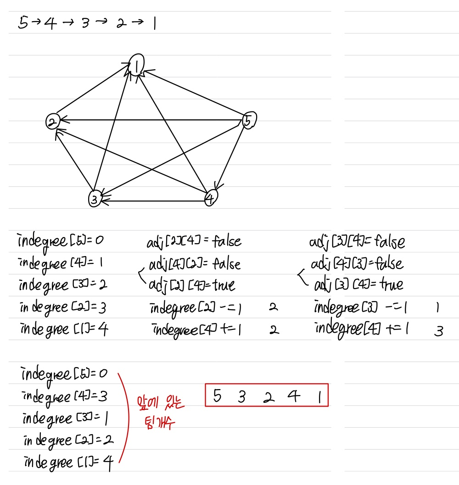

문제 링크 [https://www.acmicpc.net/problem/3665](https://www.acmicpc.net/problem/3665)

## 문제

올해 ACM-ICPC 대전 인터넷 예선에는 총 n개의 팀이 참가했다. 팀은 1번부터 n번까지 번호가 매겨져 있다. 놀랍게도 올해 참가하는 팀은 작년에 참가했던 팀과 동일하다.

올해는 인터넷 예선 본부에서는 최종 순위를 발표하지 않기로 했다. 그 대신에 작년에 비해서 상대적인 순위가 바뀐 팀의 목록만 발표하려고 한다. (작년에는 순위를 발표했다) 예를 들어, 작년에 팀 13이 팀 6 보다 순위가 높았는데, 올해 팀 6이 팀 13보다 순위가 높다면, (6, 13)을 발표할 것이다.

창영이는 이 정보만을 가지고 올해 최종 순위를 만들어보려고 한다. 작년 순위와 상대적인 순위가 바뀐 모든 팀의 목록이 주어졌을 때, 올해 순위를 만드는 프로그램을 작성하시오. 하지만, 본부에서 발표한 정보를 가지고 확실한 올해 순위를 만들 수 없는 경우가 있을 수도 있고, 일관성이 없는 잘못된 정보일 수도 있다. 이 두 경우도 모두 찾아내야 한다.

## 입력

첫째 줄에는 테스트 케이스의 개수가 주어진다. 테스트 케이스는 100개를 넘지 않는다. 각 테스트 케이스는 다음과 같이 이루어져 있다.

- 팀의 수 n을 포함하고 있는 한 줄. (2 ≤ n ≤ 500)
- n개의 정수 ti를 포함하고 있는 한 줄. (1 ≤ ti ≤ n) ti는 작년에 i등을 한 팀의 번호이다. 1등이 가장 성적이 높은 팀이다. 모든 ti는 서로 다르다.
- 상대적인 등수가 바뀐 쌍의 수 m (0 ≤ m ≤ 25000)
- 두 정수 ai와 bi를 포함하고 있는 m줄. (1 ≤ ai < bi ≤ n) 상대적인 등수가 바뀐 두 팀이 주어진다. 같은 쌍이 여러 번 발표되는 경우는 없다.

## 출력

각 테스트 케이스에 대해서 다음을 출력한다.

n개의 정수를 한 줄에 출력한다. 출력하는 숫자는 올해 순위이며, 1등팀부터 순서대로 출력한다. 만약, 확실한 순위를 찾을 수 없다면 "?"를 출력한다. 데이터에 일관성이 없어서 순위를 정할 수 없는 경우에는 "IMPOSSIBLE"을 출력한다.

## 풀이 과정

문제에서 작년 순위를 주고, 순위가 바뀐 모든 팀의 정보를 주었으므로,  
확실한 순위를 모르는 경우인 "?"인 경우는 없다.

adj[a][b] = true : a팀 다음에 b팀  
indegree[x] : x 앞에 와야 하는 팀개수



```c++
#include <vector>
#include <algorithm>
#include <iostream>
#include <cstring>
#include <stack>
#include <queue>
#include <cmath>
using namespace std;

int T, n, m, num[501], x, y;
int indegree[501];
bool adj[501][501];

void topologySort() {
	queue <int> q;
	for (int i = 1; i <= n; i++) {
		if (indegree[i] == 0) q.push(i);
	}
	vector <int> res;
	while (!q.empty()) {
		int now = q.front();
		q.pop();

		res.push_back(now);
		indegree[now]--;

		for (int i = 1; i <= n; i++) {
			if (adj[now][i]) indegree[i]--;
			if (indegree[i] == 0) q.push(i);
		}
	}
	if (res.size() == n) {
		for (int i = 0; i < n; i++) {
			cout << res[i] << " ";
		}
		cout << "\n";
	}
	else cout << "IMPOSSIBLE" << "\n";
}

int main() {
	ios::sync_with_stdio(false);
	cin.tie(NULL); cout.tie(NULL);

	cin >> T;
	while (T--) {
		cin >> n;
		for (int i = 1; i <= n; i++) {
			cin >> num[i];
		}
		for (int i = 1; i < n; i++) {
			for (int j = i + 1; j <= n; j++) {
				adj[num[i]][num[j]] = true; // num[i] 다음에 num[j]
				indegree[num[j]]++;
			}
		}

		cin >> m;
		for (int i = 0; i < m; i++) {
			cin >> x >> y;
			if (adj[x][y]) { // 원래 x가 y 앞이었던 경우
				adj[x][y] = false;
				adj[y][x] = true;
				indegree[y]--;
				indegree[x]++;
			}
			else { // 원래 y가 x 앞이었던 경우
				adj[y][x] = false;
				adj[x][y] = true;
				indegree[x]--;
				indegree[y]++;
			}
		}
		topologySort();

		memset(indegree, 0, sizeof(indegree));
		memset(adj, 0, sizeof(adj));
	}
}
```
