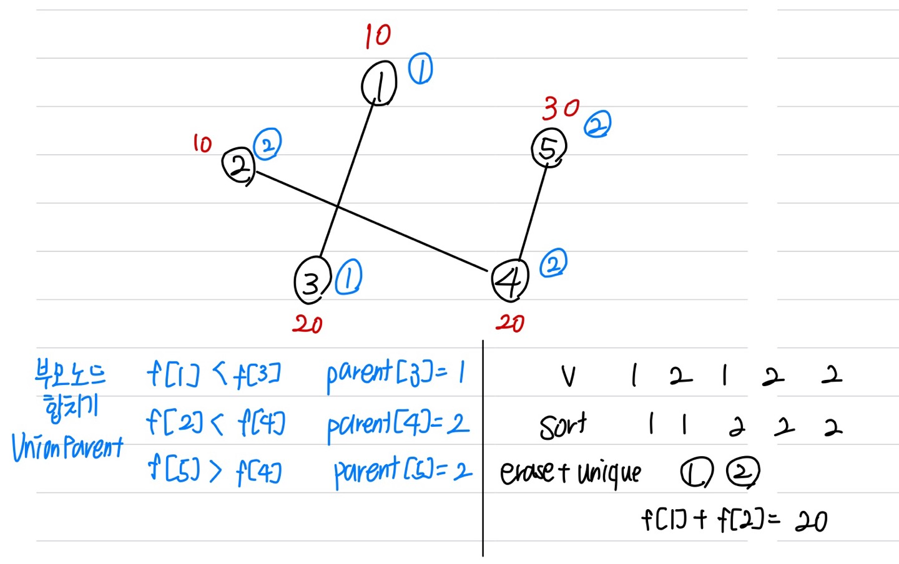

문제 링크 [https://www.acmicpc.net/problem/16562](https://www.acmicpc.net/problem/16562)

## 문제

19학번 이준석은 학생이 N명인 학교에 입학을 했다. 준석이는 입학을 맞아 모든 학생과 친구가 되고 싶어한다. 하지만 준석이는 평생 컴퓨터랑만 대화를 하며 살아왔기 때문에 사람과 말을 하는 법을 모른다. 그런 준석이에게도 희망이 있다. 바로 친구비다!

학생 i에게 Ai만큼의 돈을 주면 그 학생은 1달간 친구가 되어준다! 준석이에게는 총 k원의 돈이 있고 그 돈을 이용해서 친구를 사귀기로 했다. 막상 친구를 사귀다 보면 돈이 부족해질 것 같다는 생각을 하게 되었다. 그래서 준석이는 “친구의 친구는 친구다”를 이용하기로 했다.

준석이는 이제 모든 친구에게 돈을 주지 않아도 된다!

위와 같은 논리를 사용했을 때, 가장 적은 비용으로 모든 사람과 친구가 되는 방법을 구하라.

## 입력

첫 줄에 학생 수 N (1 ≤ N ≤ 10,000)과 친구관계 수 M (0 ≤ M ≤ 10,000), 가지고 있는 돈 k (1 ≤ k ≤ 10,000,000)가 주어진다.

두번째 줄에 N개의 각각의 학생이 원하는 친구비 Ai가 주어진다. (1 ≤ Ai ≤ 10,000, 1 ≤ i ≤ N)

다음 M개의 줄에는 숫자 v, w가 주어진다. 이것은 학생 v와 학생 w가 서로 친구라는 뜻이다.

## 출력

준석이가 모든 학생을 친구로 만들 수 있다면, 친구로 만드는데 드는 최소비용을 출력한다. 만약 친구를 다 사귈 수 없다면, “Oh no”(따옴표 제거)를 출력한다.

## 풀이 과정

연결되어 있는 노드들 중에 친구비가 작은 친구가 있다면 부모 노드를 바꿔준다.  
{: width="600" height="400"}

```c++
#include <vector>
#include <algorithm>
#include <iostream>
#include <string>
#include <stack>
#include <queue>
#include <cmath>
using namespace std;

int N, M, k, v, w;
int f[10001], parent[10001];

// 부모 노드를 찾는 함수
int getParent(int x) {
	if (parent[x] == x) return x;
	return parent[x] = getParent(parent[x]);
}

// 두 부모 노드를 친구비가 작은 노드로 합치는 함수
void unionParent(int a, int b) {
	a = getParent(a);
	b = getParent(b);
	if (f[a] > f[b]) parent[a] = b;
	else parent[b] = a;
}

int main() {
	ios::sync_with_stdio(false);
	cin.tie(NULL); cout.tie(NULL);

	cin >> N >> M >> k;
	for (int i = 1; i <= N; i++) {
		cin >> f[i];
		parent[i] = i;
	}
	for (int i = 0; i < M; i++) {
		cin >> v >> w;
		unionParent(v, w);
	}

	vector <int> v;
	for (int i = 1; i <= N; i++) {
		v.push_back(getParent(i));
	}
	sort(v.begin(), v.end());
	v.erase(unique(v.begin(), v.end()), v.end());

	int sum = 0;
	for (int i = 0; i < v.size(); i++) {
		sum += f[v[i]];
	}
	if (sum <= k) cout << sum;
	else cout << "Oh no";
}
```
