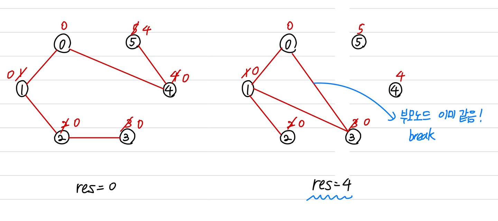

문제 링크 [https://www.acmicpc.net/problem/20040](https://www.acmicpc.net/problem/20040)

## 문제

사이클 게임은 두 명의 플레이어가 차례대로 돌아가며 진행하는 게임으로, 선 플레이어가 홀수 번째 차례를, 후 플레이어가 짝수 번째 차례를 진행한다. 게임 시작 시 0 부터 n − 1 까지 고유한 번호가 부여된 평면 상의 점 n 개가 주어지며, 이 중 어느 세 점도 일직선 위에 놓이지 않는다. 매 차례 마다 플레이어는 두 점을 선택해서 이를 연결하는 선분을 긋는데, 이전에 그린 선분을 다시 그을 수는 없지만 이미 그린 다른 선분과 교차하는 것은 가능하다. 게임을 진행하다가 처음으로 사이클을 완성하는 순간 게임이 종료된다. 사이클 C는 플레이어가 그린 선분들의 부분집합으로, 다음 조건을 만족한다.

C에 속한 임의의 선분의 한 끝점에서 출발하여 모든 선분을 한 번씩만 지나서 출발점으로 되돌아올 수 있다.

문제는 선분을 여러 개 그리다 보면 사이클이 완성 되었는지의 여부를 판단하기 어려워 이미 사이클이 완성되었음에도 불구하고 게임을 계속 진행하게 될 수 있다는 것이다. 이 문제를 해결하기 위해서 게임의 진행 상황이 주어지면 몇 번째 차례에서 사이클이 완성되었는지, 혹은 아직 게임이 진행 중인지를 판단하는 프로그램을 작성하려 한다.

입력으로 점의 개수 n과 m 번째 차례까지의 게임 진행 상황이 주어지면 사이클이 완성 되었는지를 판단하고, 완성되었다면 몇 번째 차례에서 처음으로 사이클이 완성된 것인지를 출력하는 프로그램을 작성하시오.

## 입력

입력은 표준입력을 사용한다. 입력의 첫 번째 줄에는 점의 개수를 나타내는 정수 3 ≤ n ≤ 500,000 과 진행된 차례의 수를 나타내는 정수 3 ≤ m ≤ 1,000,000 이 주어진다. 게임에서 사용하는 n개의 점에는 0 부터 n − 1 까지 고유한 번호가 부여되어 있으며, 이 중 어느 세 점도 일직선 위에 놓이지 않는다. 이어지는 m 개의 입력 줄에는 각각 i번째 차례에 해당 플레이어가 선택한 두 점의 번호가 주어진다 (1 ≤ i ≤ m).

## 출력

출력은 표준출력을 사용한다. 입력으로 주어진 케이스에 대해, m 번째 차례까지 게임을 진행한 상황에서 이미 게임이 종료되었다면 사이클이 처음으로 만들어진 차례의 번호를 양의 정수로 출력하고, m 번의 차례를 모두 처리한 이후에도 종료되지 않았다면 0을 출력한다.

## 풀이 과정

이 문제는 bool 함수를 쓰는 것이 좋았던 문제이다.



```c++
#include <vector>
#include <algorithm>
#include <iostream>
#include <string>
#include <stack>
#include <queue>
#include <cmath>
using namespace std;

int n, m, x, y;
int parent[500001];

// 부모 노드를 찾는 함수
int getParent(int x) {
	if (parent[x] == x) return x;
	return parent[x] = getParent(parent[x]);
}

// 두 부모 노드를 작은 것으로 합치는 함수
bool unionParent(int a, int b) {
	a = getParent(a);
	b = getParent(b);
	if (a == b) return true;
	else {
		if (a > b) parent[a] = b;
		else parent[b] = a;
		return false;
	}
}

int main() {
	ios::sync_with_stdio(false);
	cin.tie(NULL); cout.tie(NULL);

	cin >> n >> m;
	for (int i = 0; i < n; i++) {
		parent[i] = i;
	}

	int res = 0;
	for (int i = 0; i < m; i++) {
		cin >> x >> y;
		if (unionParent(x, y)) {
			res = i + 1;
			break;
		}
	}
	cout << res;
}
```
