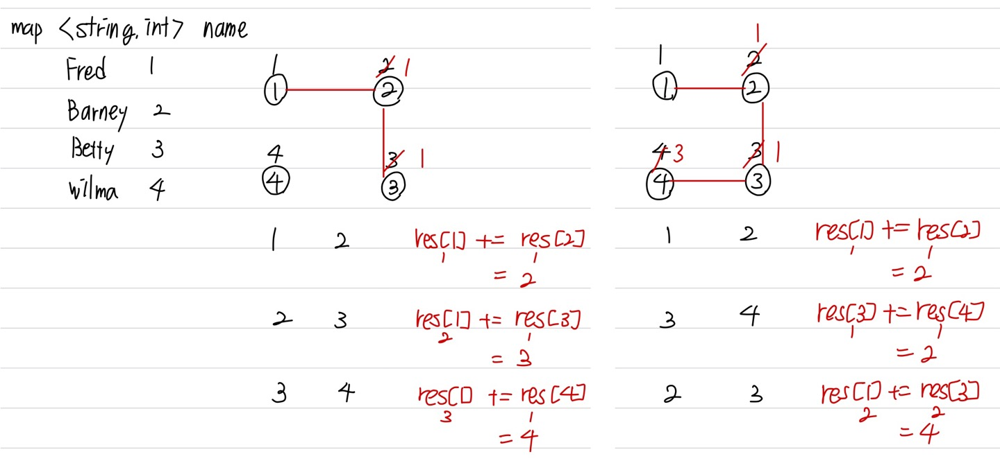

문제 링크 [https://www.acmicpc.net/problem/4195](https://www.acmicpc.net/problem/4195)

## 문제

민혁이는 소셜 네트워크 사이트에서 친구를 만드는 것을 좋아하는 친구이다. 우표를 모으는 취미가 있듯이, 민혁이는 소셜 네트워크 사이트에서 친구를 모으는 것이 취미이다.

어떤 사이트의 친구 관계가 생긴 순서대로 주어졌을 때, 두 사람의 친구 네트워크에 몇 명이 있는지 구하는 프로그램을 작성하시오.

친구 네트워크란 친구 관계만으로 이동할 수 있는 사이를 말한다.

## 입력

첫째 줄에 테스트 케이스의 개수가 주어진다. 각 테스트 케이스의 첫째 줄에는 친구 관계의 수 F가 주어지며, 이 값은 100,000을 넘지 않는다. 다음 F개의 줄에는 친구 관계가 생긴 순서대로 주어진다. 친구 관계는 두 사용자의 아이디로 이루어져 있으며, 알파벳 대문자 또는 소문자로만 이루어진 길이 20 이하의 문자열이다.

## 출력

친구 관계가 생길 때마다, 두 사람의 친구 네트워크에 몇 명이 있는지 구하는 프로그램을 작성하시오.

## 풀이 과정

이 문제는 유니온 파인드와 map 알고리즘이 섞인 문제이다.  
유니온 파인드 알고리즘을 하려면, 처음에 parent 배열에 각자 자신의 번호로 초기화 시켜준다.  
한 줄에 2명씩 입력되므로 최대 노드 개수는 2 \* F 개가 된다.

입력을 받을 때, 만약 map.count가 0이라면 idx를 넣어주고 1씩 플러스 해준다.  
그 다음 unionParent 함수를 실행하고, 다른 집합일 경우에는  
부모 노드가 크거나 작거나에 상관없이 일단 집합을 연결해준다.

res[a]에 res[b]를 더하며 최종적으로 res[a]를 리턴하게 한다.  
res[b]값을 1로 만드는 이유는 나중에 다른 곳에서 쓰일 수도 있기 때문이다.

{:width="570" height="400"}

```c++
#include <algorithm>
#include <iostream>
#include <map>
using namespace std;

int T, F;
int parent[200001], res[200001];
string a, b;

// 부모 노드를 찾는 함수
int getParent(int x) {
	if (parent[x] == x) return x;
	return parent[x] = getParent(parent[x]);
}

// 두 집합을 합치는 함수
int unionParent(int a, int b) {
	a = getParent(a);
	b = getParent(b);
	if (a != b) { // 다른 집합
		parent[b] = a; // 집합 연결
		res[a] += res[b];
		res[b] = 1;
	}
	return res[a];
}

int main() {
	ios::sync_with_stdio(false);
	cin.tie(NULL); cout.tie(NULL);

	cin >> T;
	while (T--) {
		cin >> F;
		// 한 줄에 2명씩 입력되므로 최대 노드개수 2 * F
		for (int i = 1; i <= 2 * F; i++) {
			parent[i] = i;
			res[i] = 1; // 총 연결된 노드 개수
		}
		int idx = 1;
		map <string, int> name;
		for (int i = 0; i < F; i++) {
			cin >> a >> b;
			if (name.count(a) == 0) name[a] = idx++;
			if (name.count(b) == 0) name[b] = idx++;
			cout << unionParent(name[a], name[b]) << "\n";
		}
	}
}
```
