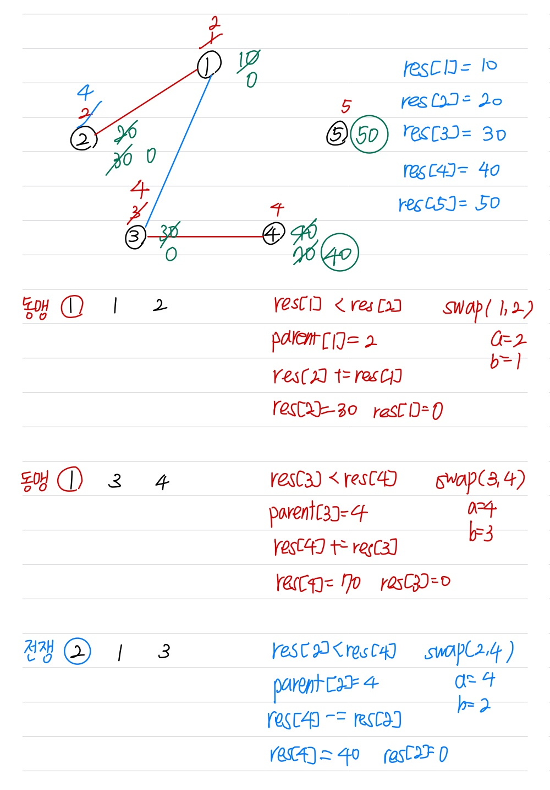

문제 링크 [https://www.acmicpc.net/problem/15809](https://www.acmicpc.net/problem/15809)

## 문제

전국시대엔 N개의 국가가 존재한다. 각 국가는 1부터 N까지의 번호를 가지고 있다.

또한, 모든 국가는 각자 자신의 국가의 힘을 상징하는 병력을 가지고 있다. 이때 M개의 기록이 주어진다. 각각의 기록은 다음과 같다.

1. 동맹 - 두 나라가 서로 동맹을 맺는다. 두 나라의 병력이 하나로 합쳐진다.
1. 전쟁 - 두 나라가 서로 전쟁을 벌인다. 병력이 더 많은 나라가 승리하며 패배한 나라는 속국이 된다. 이때 남은 병력은 승리한 나라의 병력에서 패배한 나라의 병력을 뺀 수치가 된다. 두 나라의 병력이 같을 경우 두 나라 모두 멸망한다.

모든 나라는 정직하기 때문에 내 동맹의 동맹도 나의 동맹이고, 내 동맹이 적과 전쟁을 시작하면 같이 참전한다. 속국인 경우도 동맹의 경우와 마찬가지이다.

따라서, 전쟁에서 진 국가와 동맹인 다른 국가 또한 전쟁에서 이긴 국가의 속국이 된다.

모든 기록이 끝났을 때 남아있는 국가의 수를 출력하고, 그 국가들의 남은 병력의 수를 오름차순으로 출력하는 프로그램을 작성하시오.

단, 여러 국가가 서로 동맹이거나 속국 관계인 경우는 한 국가로 취급한다.

## 입력

첫 번째 줄에 국가의 수를 나타내는 N과 기록의 수 M이 주어진다. (1 ≤ N, M ≤ 100,000)

두 번째 줄 부터 N개의 줄에 걸쳐 i번째 국가의 병력 Ai (1 ≤ i ≤ N)가 자연수로 주어진다. (1 ≤ Ai ≤ 10,000)

다음 M개의 줄에는 기록이 3개의 정수 O, P, Q로 주어진다. O가 1인 경우 P, Q가 서로 동맹을 맺었음을 의미하고, O가 2인 경우 P, Q가 서로 전쟁을 벌였음을 의미한다.

동맹끼리 다시 동맹을 맺거나 전쟁하는 입력은 주어지지 않는다.

## 출력

첫째 줄에 남아있는 국가의 수를 출력한다.

다음 줄에 각 국가의 남은 병력의 수를 띄어쓰기를 간격으로 오름차순으로 출력한다.

## 풀이 과정

{: width="600px" height="1200px"}

```c++
#include <vector>
#include <algorithm>
#include <iostream>
#include <cstring>
using namespace std;

int N, M, op, P, Q;
int parent[100001], res[100001];

int getParent(int x) {
	if (parent[x] == x) return x;
	return parent[x] = getParent(parent[x]);
}

void unionParent(int op, int a, int b) {
	a = getParent(a);
	b = getParent(b);
	if (a != b) { // 부모가 다르며 다른 집합일 경우
		if (res[a] < res[b]) swap(a, b); // 값 교환 함수
		parent[b] = a; // 작은 값의 부모 노드를 큰 값의 부모 노드에게
		if (op == 1) res[a] += res[b]; // 동맹
		else res[a] -= res[b]; // 전쟁
		res[b] = 0;
	}
}

int main() {
	ios::sync_with_stdio(false);
	cin.tie(NULL); cout.tie(NULL);

	cin >> N >> M;
	for (int i = 1; i <= N; i++) {
		parent[i] = i;
		cin >> res[i];
	}
	for (int i = 0; i < M; i++) {
		cin >> op >> P >> Q;
		unionParent(op, P, Q);
	}

	vector <int> v;
	for (int i = 1; i <= N; i++) {
		if (res[i] > 0) v.push_back(res[i]);
	}
	cout << v.size() << "\n";
	sort(v.begin(), v.end());
	for (int i = 0; i < v.size(); i++) cout << v[i] << " ";
}
```
