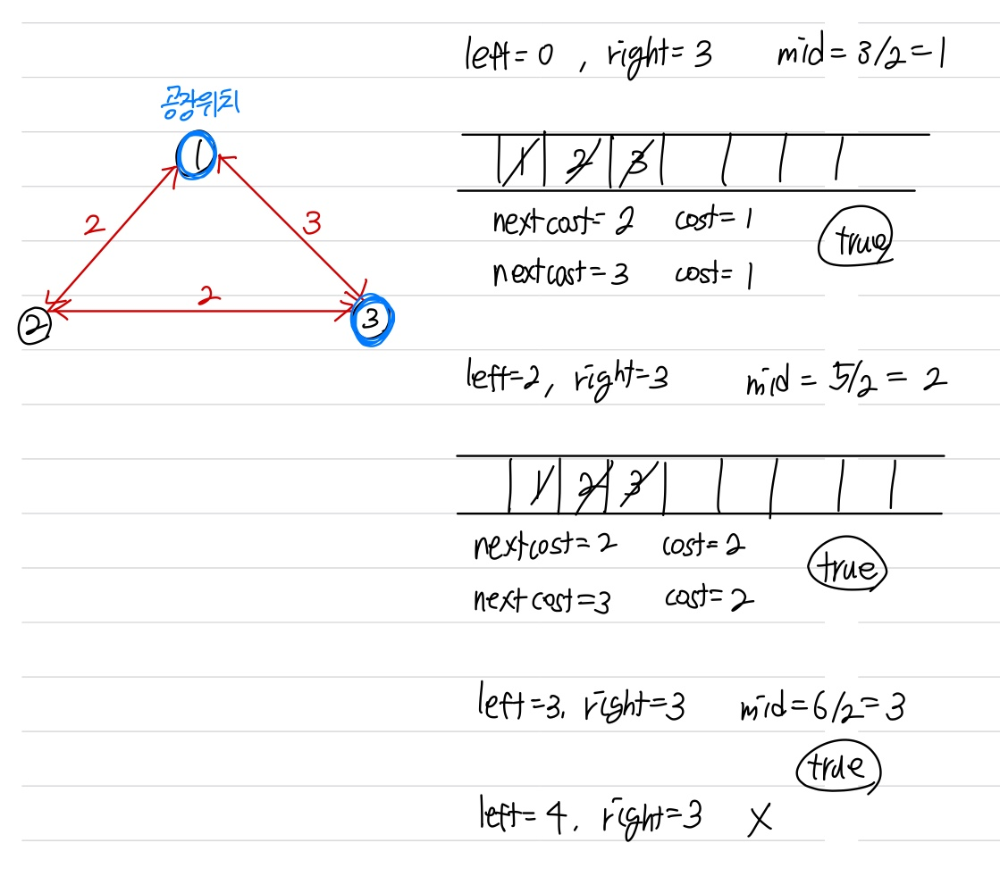

문제 링크 [https://www.acmicpc.net/problem/1939](https://www.acmicpc.net/problem/1939)

## 문제

N(2 ≤ N ≤ 10,000)개의 섬으로 이루어진 나라가 있다. 이들 중 몇 개의 섬 사이에는 다리가 설치되어 있어서 차들이 다닐 수 있다.

영식 중공업에서는 두 개의 섬에 공장을 세워 두고 물품을 생산하는 일을 하고 있다. 물품을 생산하다 보면 공장에서 다른 공장으로 생산 중이던 물품을 수송해야 할 일이 생기곤 한다. 그런데 각각의 다리마다 중량제한이 있기 때문에 무턱대고 물품을 옮길 순 없다. 만약 중량제한을 초과하는 양의 물품이 다리를 지나게 되면 다리가 무너지게 된다.

한 번의 이동에서 옮길 수 있는 물품들의 중량의 최댓값을 구하는 프로그램을 작성하시오.

## 입력

첫째 줄에 N, M(1 ≤ M ≤ 100,000)이 주어진다. 다음 M개의 줄에는 다리에 대한 정보를 나타내는 세 정수 A, B(1 ≤ A, B ≤ N), C(1 ≤ C ≤ 1,000,000,000)가 주어진다. 이는 A번 섬과 B번 섬 사이에 중량제한이 C인 다리가 존재한다는 의미이다. 서로 같은 두 섬 사이에 여러 개의 다리가 있을 수도 있으며, 모든 다리는 양방향이다. 마지막 줄에는 공장이 위치해 있는 섬의 번호를 나타내는 서로 다른 두 정수가 주어진다. 공장이 있는 두 섬을 연결하는 경로는 항상 존재하는 데이터만 입력으로 주어진다.

## 출력

첫째 줄에 답을 출력한다.

## 풀이 과정

이 문제는 이분탐색, BFS, 유니온 파인드  
3개의 알고리즘이 섞인 문제여서 매우 어려웠던 문제이다.
{: width="650" height="800"}

```c++
#include <vector>
#include <algorithm>
#include <iostream>
#include <cstring>
#include <queue>
using namespace std;

int n, m, A, B, cost, s, e;
bool c[10001];

vector <pair<int, int>> v[10001];

bool bfs(int cost) {
	queue <int> q;
	q.push(s);
	c[s] = 1;

	while (!q.empty()) {
		int now = q.front();
		q.pop();

		if (now == e) return true;
		for (int i = 0; i < v[now].size(); i++) {
			int next = v[now][i].first;
			int nextcost = v[now][i].second;

			if (!c[next] && nextcost >= cost) {
				c[next] = 1;
				q.push(next);
			}
		}
	}
	return false;
}

int main() {
	ios::sync_with_stdio(false);
	cin.tie(NULL); cout.tie(NULL);

	cin >> n >> m;

	int max = 0;
	for (int i = 0; i < m; i++) {
		cin >> A >> B >> cost;
		v[A].push_back({ B, cost });
		v[B].push_back({ A, cost });
		if (cost > max) max = cost;
	}
	cin >> s >> e;

	int left = 0, right = max;
	while (left <= right) {
		memset(c, 0, sizeof(c));

		int mid = (left + right) / 2;
		if (bfs(mid)) left = mid + 1;
		else right = mid - 1;
	}
	cout << right << "\n";
	return 0;
}
```
