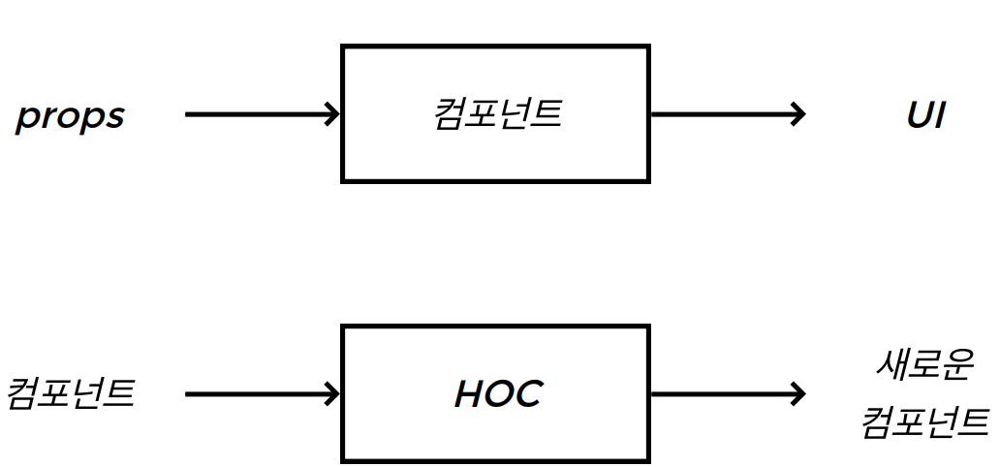

# Higher Order Component(HOC)

HOC는 &lt;컴포넌트&gt;를 인자로 받아 &lt;새로운 컴포넌트&gt;를 리턴하는 함수

- 컴포넌트 안에 있는 로직을 다시 재활용할 수 있는 고급 기술이다.
- React API의 한 파트가 아니다.
- 리액트의 컴포넌트를 상속받거나 재활용하는 방식이 아니라 조합방식으로 하는 본성으로부터 야기된 패턴이다.

```jsx
HOC = function(컴포넌트) {return 새로운 컴포넌트;}
```



withRouter()  
보통 with가 붙은 함수가 HOC인 경우가 많다.

# Controlled Component, Uncontrolled Component

엘리먼트의 '상태'를 누가 관리하느냐

- 엘리먼트를 가지고 있는 컴포넌트가 관리
  - Controlled
- 엘리먼트의 상태를 관리하지 않고, 엘리먼트의 참조만 컴포넌트가 소유

  - Uncontrolled

## Controlled Component

```jsx
import React from "react";

class ControlledComponent extends React.Component {
  state = {
    value: "",
  };

  render() {
    const { value } = this.state;
    return (
      <div>
        <input value={value} onChange={this.change} />
        <button onClick={this.click}>전송</button>
      </div>
    );
  }

  change = (e) => {
    console.log(e.target.value);
    this.setState({ value: e.target.value });
  };
  click = () => {
    console.log(this.state.value);
  };
}

export default ControlledComponent;
```

## Uncontrolled Component

리액트에서는 지양하는 방식이다. 리액트는 Virtual dom을 쓰고 있고, jsx로 react element를 만들어내고 있기 때문에 직접 가져와서 real dom에 변조를 가하거나, 값을 읽어들이는 것을 선호하지 않는다. 단방향으로 계속 render되는 상태를 깰 수 있다.

```jsx
import React from "react";

class UncontrolledComponent extends React.Component {
  render() {
    return (
      <div>
        <input id="my-input" />
        <button onClick={this.click}>전송</button>
      </div>
    );
  }

  click = () => {
    // input 엘리먼트의 현재 상태 값(value)을 꺼내서 전송한다.
    const input = document.querySelector("#my-input");
    console.log(input.value);
  };
}

export default UncontrolledComponent;
```

=> 그래서 나온 것이 **reference** 일종의 저장 장치

```jsx
import React from "react";

class UncontrolledComponent extends React.Component {
  inputRef = React.createRef();

  render() {
    console.log("initial render", this.inputRef); // {current: null}
    return (
      <div>
        <input ref={this.inputRef} />
        <button onClick={this.click}>전송</button>
      </div>
    );
  }

  componentDidMount() {
    console.log("componentDidMount", this.inputRef); // {current: input}
  }

  click = () => {
    console.log(this.inputRef.current.value);
  };
}

export default UncontrolledComponent;
```
