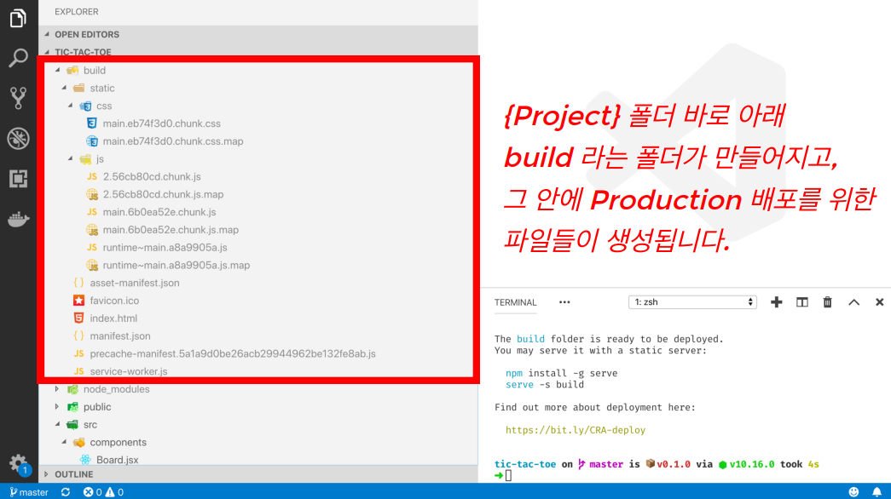

# SPA 프로젝트 배포 이해하기

SPA Deploy의 특징

- 모든 요청을 서버에 하고 받아오는 형태가 아님
- 라우팅 경로에 상관없이 리액트 앱을 받아 실행
- 라우팅은 받아온 리액트 앱을 실행 후, 적용
- static 파일을 제외한 모든 요청을 index.html 로 응답해주도록 작업

```bash
npm run build
```

- production 모드로 빌드되어, "build" 폴더에 파일 생성
  - 이렇게 만들어진 파일들을 웹서버를 통해 사용자가 접근할 수 있도록 처리
- build/static 폴더 안에 js, css 파일들이 생성
  - 파일 이름에 hash 값이 붙는다.
    - long term caching techniques
    - ex) main.eb74f3d0.chunk.css



# serve 패키지로 React Web App 배포하기

```bash
npm install serve -g
serve -s build
```

- serve라는 패키지를 전역으로 설치한다.
- serve 명령어를 -s 옵션으로 build 폴더를 지정하여 실행한다.
  - -s 옵션은 어떤 라우팅으로 요청해도 index.html을 응답하도록 한다.

# AWS S3에 React Web App 배포하기

# node.js express로 React Web App 배포하기

```bash
npm i express
```

server.js

```jsx
const express = require("express");
const path = require("path");

const app = express();

app.use(express.static(path.join(__dirname, "build")));

app.get("*", (req, res) => {
  res.sendFile(path.join(), "build", "index.html");
});

app.listen(9000);
```

```bash
node server.js
```

localhost:9000

# NginX로 React Web App 배포하기

# 서버 사이드 렌더링 이해하기

## Server Side Rendering

- 서버에서 응답을 가져올 때, 기존처럼 static file만을 가져오는 것이 아니고, 먼저 서버에서 응답 값을 만들어서 내려주고, 그 후에 static file을 내려준다.
- static file을 다 내려받고, 리액트 앱을 브라우저에서 실행한 뒤에는 SPA처럼 동작하게 된다.

## React Server Side Rendering

- React Component를 브라우저가 아니라 Node.js에서 사용
- ReactDOMServer.renderToString(<App />);
  - 결과가 문자열
  - 이것을 응답으로 내려준다.
- 라우팅, 리덕스와 같은 처리를 서버에서 진행하고 내려준다.
  - 복잡, 어렵
- JSX가 포함된 리액트 코드를 서버에서 읽을 수 있도록 babel 설정을 해야한다.

```jsx
const express = require("express");
const path = require("path");
const ReactDOMServer = require("react-dom/server");
const React = require("react");
const fs = require("fs");

// <div>Hello</div>
console.log(
  ReactDOMServer.renderToString(React.createElement("div"), null, "Hello")
);

const app = express();

app.use(express.static(path.join(__dirname, "build")));

app.get("/test", (req, res) => {
  const ssr = ReactDOMServer.renderToString(
    React.createElement("div", null, "Hello")
  );
  const indexHtml = fs
    .readFileSync(path.join(__dirname, "build", "index.html"))
    .toString()
    .replace(`<div id="root"></div>`, `<div id="root">${ssr}</div>`);

  console.log(indexHtml);
  res.send(indexHtml);
});

app.get("*", (req, res) => {
  res.sendFile(path.join(), "build", "index.html");
});

app.listen(9000);
```
