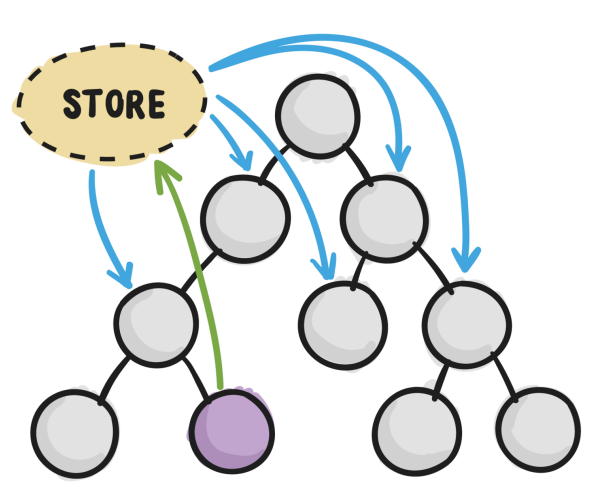

# Redux 개요

애플리케이션의 전역 상태를 효과적으로 공유하고 관리하기 위해 redux가 등장했다. 리덕스가 이야기하는 리듀서와 액션의 개념을 익혀서 상태를 변화시키고 그에 따른 상태변화를 구독해서 적절한 화면을 렌더링할 수 있게 되었다. 리덕스는 상태를 변화시키는 방법과 상태의 변이를 구독하는 멋진 방법을 우리에게 제공한다.

component - Communication  
Context를 사용할 경우에 Context가 가지고 있는 전역 데이터를 효과적으로 관리할 것에 대한 라이브러리가 Redux이다.



보라색 공이 store안에 상태를 변경하려는 것이고  
하늘색은 상태가 변했으니 다시 render하는 것이다.

1. 단일 store를 만드는 법
1. 리액트에서 store 사용하는 법

- 단일 스토어다.
- [만들기] 단일 스토어 사용 준비하기
  - import redux
  - 액션을 정의하고
  - 액션을 사용하는 리듀서를 만들고,
  - 리듀서들을 합친다.
  - 최종 합쳐진 리듀서를 인자로, 단일 스토어를 만든다.
- [사용하기] 준비한 스토어를 리액트 컴포넌트에서 사용하기
  - import react-redux
  - connect 함수를 이용해서 컴포넌트에 연결

# Action 액션

## 리덕스의 액션

- 액션은 사실 객체(object)이다.
- 두 가지 형태의 액션이 있다.
  - {type: "TEST"} // payload 없는 액션
  - {type: "TEST", params: "hello"} // payload 있는 액션
- type만이 필수 프로퍼티이며, type은 문자열이다.

## 리덕스의 액션 생성자

    function 액션생성자(...args) { return 액션; }

- 액션을 생성하는 함수를 "액션 생성자(Action Creator)"라고 한다.
- 함수를 통해 액션을 생성해서, 액션 객체를 리턴해준다.
- createTest("hello"); // {type: "TEST", params: "hello" } 리턴

## 리덕스의 액션 하는 일

- 액션 생성자를 통해 액션을 만들어낸다.
- 만들어낸 액션 객체를 리덕스 스토어에 보낸다.
- 리덕스 스토어가 액션 객체를 받으면 스토어의 상태 값이 변경된다.
- 변경된 상태 값에 의해 상태를 이용하고 있는 컴포넌트가 변경된다.
- 액션은 스토어에 보내는 일종의 인풋이라 생각할 수 있다.

## 액션을 준비하기 위해서는?

- 액션의 타입을 정의하여 변수로 빼는 단계
  - 강제는 아니다. (안해도 된다.)
  - 그냥 타입을 문자열로 넣기에는 실수를 유발할 가능성이 크다.
  - 미리 정의한 변수를 사용하면, 스펠링에 주의를 덜 기울여도 된다.
- 액션 객체를 만들어내는 함수를 만드는 단계
  - 하나의 액션 객체를 만들기 위해 하나의 함수를 만들어낸다.
  - 액션의 타입은 미리 정의한 타입 변수로부터 가져와서 사용한다.

액션의 타입을 정의하고, 액션 생성자를 하나 만들었다.

redux/actions.js

```js
const ADD_TODO = "ADD_TODO";

// 액션 생성 함수
function addTodo(todo) {
  return {
    type: ADD_TODO,
    todo, // todo: todo,
  };
}
```

# Reducers 리듀서

- 액션을 주면, 그 액션이 적용되어 달라진(안 달라질 수도 있음) 결과를 만들어 준다.
- 그냥 함수이다.

  - Pure Function
  - Immutable

    - 리듀서를 통해 상태가 달라졌음을 리덕스가 인지하는 방식이다.

    function 리듀서(previousState, action) {
    return newState;
    }

- 액션을 받아서 state를 리턴하는 구조
- 인자로 들어오는 previousState와 리턴되는 newState는 다른 참조를 가지도록 해야한다.

redux/actions.js

```js
export const ADD_TODO = "ADD_TODO"; // 문자열보단 변수

// 액션 생성자 함수
function addTodo(todo) {
  return {
    type: ADD_TODO,
    todo, // todo: todo,
  };
}
```

redux/reducers.js

```js
import { ADD_TODO } from "./actions";

// state
// ["코딩", "점심 먹기"];
const initialState = [];

function todoApp(previousState = initialState, action) {
  // 초기값을 설정해주는 부분
  // if (previousState === undefined) {
  //   return [];
  // }
  if (action.type === ADD_TODO) {
    return [...previousState, action.todo]; // 새로운 객체
  }

  // previousState.push(""); // 객체는 변경되지만, 레퍼런스는 변경 안됨

  return previousState; // 아무 변화 없음
}
```

# createStore

redux로 부터 import

## 스토어를 만드는 함수

    const store = createStore(리듀서);

```js
createStore<S> (
  reducer: Reducer<S>,
  preloadedState: S,
  enhancer?: StoreEnhancer<S>
): Store<S>;
```

redux/store.js

```js
import { createStore } from "redux";
import { todoApp } from "./reducers";

const store = createStore(todoApp); // 스토어 만드는 함수

export default store;
```

index.js

```js
import React from "react";
import ReactDOM from "react-dom";
import "./index.css";
import App from "./App";
import reportWebVitals from "./reportWebVitals";
import store from "./redux/store";
import { addTodo } from "./redux/actions.js";

// store에 변경사항이 생기는 것을 구독한다.
// store에 상태가 변경되면 호출됨
const unsubscribe = store.subscribe(() => {
  console.log(store.getState());
});

// action객체를 넣어서 실행
store.dispatch(addTodo("coding"));
store.dispatch(addTodo("read book"));
store.dispatch(addTodo("eat"));
unsubscribe();
store.dispatch(addTodo("coding"));
store.dispatch(addTodo("read book"));
store.dispatch(addTodo("eat"));

ReactDOM.render(
  <React.StrictMode>
    <App />
  </React.StrictMode>,
  document.getElementById("root")
);

reportWebVitals();
```

## store 정리

- store.getState();
- store.dispatch(액션); store.dispatch(액션생성자());
- cosnt unsubscribe = store.subscribe(()=>{});
  - 리턴이 unsubscribe 라는 점!
  - unsubscribe(); 하면 제거
- store.replaceReducer(다른 리듀서);

# combineReducers

{todos: [{text: "코딩", done: false}, {text: "점심 먹기", done: false}], filter: "ALL"}

redux/reducers/reducer.js

```js
import { combineReducers } from "redux";
import todos from "./todos";
import filter from "./filter";

const reducer = combineReducers({
  todos,
  filter,
});

export default reducer;
```

redux/reducers/filter.js

```js
import { SHOW_COMPLETE, SHOW_ALL } from "../actions.js";

const initialState = "ALL";

// filter에만 영향을 준다.
export default function filterReducer(
  previousState = initialState.filter,
  action
) {
  if (action.type === SHOW_COMPLETE) {
    return "COMPLETE";
  }

  if (action.type === SHOW_ALL) {
    return "ALL";
  }

  return previousState;
}
```

redux/reducers/todos.js

```js
import { ADD_TODO, COMPLETE_TODO } from "../actions.js";

const initialState = [];

// todos에만 영향을 준다.
export default function todosReducer(
  previousState = initialState.todos,
  action
) {
  if (action.type === ADD_TODO) {
    return [...previousState, { text: action.text, done: false }];
  }

  if (action.type === COMPLETE_TODO) {
    return previousState.map((todo, index) => {
      if (index === action.index) {
        return { ...todo, done: true };
      }
      return todo;
    });
  }

  return previousState;
}
```

redux/actions.js

```js
export const ADD_TODO = "ADD_TODO";
export const COMPLETE_TODO = "COMPLETE_TODO";

// {type: ADD_TODO, text: "할 일"}
export function addTodo(text) {
  return {
    type: ADD_TODO,
    text,
  };
}

// index를 받아서 done을 바꿔준다
// {type: COMPLETE_TODO, index: 3}
export function completeTodo(index) {
  return {
    type: COMPLETE_TODO,
    index,
  };
}

export const SHOW_ALL = "SHOW_ALL";
export const SHOW_COMPLETE = "SHOW_COMPLETE";

export function showALL() {
  return { type: SHOW_ALL };
}

export function showComplete() {
  return { type: SHOW_COMPLETE };
}
```

redux/store.js

```js
import { createStore } from "redux";
import todoApp from "./reducers/reducer";

const store = createStore(todoApp); // 스토어 만드는 함수

export default store;
```

# Redux를 React에 연결

단일 store를 만들고,  
subscribe와 getState를 이용하여,  
변경되는 state 데이터를 얻어,  
props로 계속 아래로 전달

componentDidMount - subscribe  
componentWillUnmount - unsubscribe

=> pros 방법

index.js

```js
import React from "react";
import ReactDOM from "react-dom";
import "./index.css";
import App from "./App";
import reportWebVitals from "./reportWebVitals";
import store from "./redux/store";
import ReduxContext from "./contexts/ReduxContext.js";

ReactDOM.render(
  <React.StrictMode>
    <App store={store} />
  </React.StrictMode>,
  document.getElementById("root")
);

reportWebVitals();
```

App.js

```js
import logo from "./logo.svg";
import "./App.css";
import { useEffect, useState } from "react";
import { addTodo } from "./redux/actions";

function App({ store }) {
  const [state, setState] = useState(store.getState());

  useEffect(() => {
    const unsubscirbe = store.subscribe(() => {
      setState(store.getState());
    });

    // willUnmount에서 실행되는
    return () => {
      unsubscirbe();
    };
  }, [store]); // 한번만 실행되고

  return (
    <div className="App">
      <header className="App-header">
        
        {/* state는 object이기 때문에 문자열로 바꿔 출력 */}
        {JSON.stringify(state)}
        <button onClick={click}>추가</button>
      </header>
    </div>
  );

  function click() {
    store.dispatch(addTodo("todo"));
  }
}

export default App;
```

## react-redux 안 쓰고 연결하기

### components

TodoList.jsx

```jsx
import useReduxState from "./../hooks/useReduxState";

export default function TodoList() {
  const state = useReduxState();

  return (
    <ul>
      {state.todos.map((todo) => {
        return <li>{todo.text}</li>;
      })}
    </ul>
  );
}
```

TodoForm.jsx

```jsx
import { useRef } from "react";
import useReduxDispatch from "./../hooks/useReduxDispatch";
import { addTodo } from "./../redux/actions";

// unCotrolledComponent
export default function TodoForm() {
  const inputRef = useRef();
  const dispatch = useReduxDispatch();

  return (
    <div>
      <input ref={inputRef} />
      <button onclick={click}>추가</button>
    </div>
  );

  function click() {
    dispatch(addTodo(inputRef.current.value));
  }
}
```

### hooks

useReduxState.js

```js
import { useContext, useEffect, useState } from "react";
import ReduxContext from "./../contexts/ReduxContext";

export default function useReduxState() {
  const store = useContext(ReduxContext);
  const [state, setState] = useState(store.getState());

  useEffect(() => {
    const unsubscirbe = store.subscribe(() => {
      setState(store.getState());
    });

    // willUnmount에서 실행되는
    return () => {
      unsubscirbe();
    };
  }, [store]); // 한번만 실행되고

  return state;
}
```

useReduxDispatch.js

```js
import { useContext } from "react";
import ReduxContext from "./../contexts/ReduxContext";

export default function useReduxDispatch() {
  const store = useContext(ReduxContext);

  return store.dispatch;
}
```

### contexts

ReduxContext.js

```js
import { createContext } from "react";

const ReduxContext = createContext();

export default ReduxContext;
```

### App.js

```js
import logo from "./logo.svg";
import "./App.css";
import TodoList from "./components/TodoList";
import TodoForm from "./components/TodoForm";

function App() {
  return (
    <div className="App">
      <header className="App-header">
        
        <TodoList />
        <TodoForm />
      </header>
    </div>
  );
}

export default App;
```

### index.js

```js
import React from "react";
import ReactDOM from "react-dom";
import "./index.css";
import App from "./App";
import reportWebVitals from "./reportWebVitals";
import store from "./redux/store";
import ReduxContext from "./contexts/ReduxContext.js";

ReactDOM.render(
  <React.StrictMode>
    {/* 앱 하위에 있는 모든 컴포넌트들은 store를 꺼내 쓸 수 있음 */}
    <ReduxContext.Provider value={store}>
      <App />
    </ReduxContext.Provider>
  </React.StrictMode>,
  document.getElementById("root")
);

reportWebVitals();
```

## react-redux 쓰고 연결하기

=> react-redux

- provider 컴포넌트를 제공해준다.
- connect 함수를 통해 "컨네이너"를 만들어준다.

  - 컨테이너는 스토어의 state와 dispatch(액션)을 연결한 컴포넌트에 props로 넣어주는 역할을 한다.
  - 그렇다면 필요한 거은?

    - 어떤 state를 어떤 props에 연결할 것인지에 대한 정의
    - 어떤 dispatch(액션)을 어떤 props에 연결할 것인지에 대한 정의
    - 그 props를 보낼 컴포넌트 정의

```bash
npm i react-redux
```

### containers

TodoFormContainer.jsx  
=> HOC 방식

```jsx
import { connect } from "react-redux";
import { addTodo } from "./../redux/actions";
import TodoForm from "../components/TodoForm";

// 컨테이너 또는 스마트한 컴포넌트
// store와 프레젠테이션 컴포넌트를 이어주는 컴포넌트
const TodoFormContainer = connect(
  (state) => ({}),
  (dispatch) => ({
    add: (text) => {
      dispatch(addTodo(text));
    },
  })
)(TodoForm);

export default TodoFormContainer;
```

=> Hooks 방식

```jsx
import { useDispatch } from "react-redux";
import { addTodo } from "./../redux/actions";
import TodoForm from "../components/TodoForm";
import { useCallback } from "react";

export default function TodoFormContainer() {
  const dispatch = useDispatch();

  const add = useCallback(
    (text) => {
      dispatch(addTodo(text));
    },
    [dispatch]
  );

  return <TodoForm add={add} />;
}
```

TodoListContainer.jsx  
=> HOC 방식

```jsx
import { connect } from "react-redux";
import TodoList from "./../components/TodoList";

const mapStateToProps = (state) => {
  return {
    todos: state.todos,
  };
};

const mapDispatchToProps = (dispatch) => {
  return {};
};

// 실행한 결과물이 HOC함수가 된다. 그러므로 함수를 다시 실행
// connect 함수를 실행한 결과가 함수고, 그 함수를 실행한 결과가 컨테이너이다.
const TodoListContainer = connect(
  mapStateToProps,
  mapDispatchToProps
)(TodoList);

export default TodoListContainer;
```

=> Hooks 방식

```jsx
import { useSelector } from "react-redux";
import TodoList from "./../components/TodoList";

function TodoListContainer() {
  const todos = useSelector((state) => state.todos);

  return <TodoList todos={todos} />;
}

export default TodoListContainer;
```

### components

TodoForm.jsx

```jsx
import { useRef } from "react";

// 프레젠테이션 컴포넌트
export default function TodoForm({ add }) {
  const inputRef = useRef();

  return (
    <div>
      <input ref={inputRef} />
      <button onclick={click}>추가</button>
    </div>
  );

  function click() {
    add(inputRef.current.value);
  }
}
```

TodoList.jsx

```jsx
export default function TodoList({ todos }) {
  return (
    <ul>
      {todos.map((todo) => {
        return <li>{todo.text}</li>;
      })}
    </ul>
  );
}
```

### App.js

```js
import logo from "./logo.svg";
import "./App.css";
import TodoListContainer from "./containers/TodoListContainer";
import TodoFormContainer from "./containers/TodoFormContainer";

function App() {
  return (
    <div className="App">
      <header className="App-header">
        
        <TodoListContainer />
        <TodoFormContainer />
      </header>
    </div>
  );
}

export default App;
```

### index.js

```js
import React from "react";
import ReactDOM from "react-dom";
import "./index.css";
import App from "./App";
import reportWebVitals from "./reportWebVitals";
import store from "./redux/store";
import { Provider } from "react-redux";

ReactDOM.render(
  <React.StrictMode>
    {/* value가 아닌 props로 정확한 이름 받음 */}
    <Provider store={store}>
      <App />
    </Provider>
  </React.StrictMode>,
  document.getElementById("root")
);

reportWebVitals();
```
