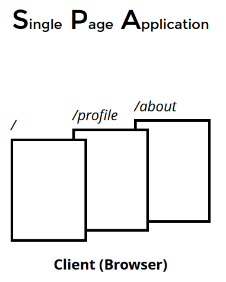

## React의 라우팅 이해하기

=> react-router-dom  


- cra(create-react-app)에 기본 내장된 패키지가 아니다.
- react-router-dom은 facebook의 공식 패키지는 아니다.
- 가장 대표적인 라우팅 패키지다.

=> SPA? 서버로부터 각각의 페이지를 요청하는 것과 다르게 한 번에 덩어리를 받아오고 내부에서 url에 맞춰 보여줄 것만 보여주는 것이다.  


## SPA 라우팅 과정

1. 브라우저에서 최초에 '/' 경로로 요청을 하면,
1. React Web App을 내려준다.
1. 내려받은 React App에서 '/' 경로에 맞는 컴포넌트를 보여준다.
1. React App에서 다른 페이지로 이동하는 동작을 수행하면,
1. 새로운 경로에 맞는 컴포넌트를 보여준다.

## 설치

```bash
npx create-react-app 파일이름
```

```bash
npm i react-router-dom
```

특정 경로에서 보여줄 컴포넌트를 준비한다.

- '/' => Home 컴포넌트

```jsx
export default function Home() {
  return <div>Home 페이지입니다.</div>;
}
```

- '/profile' => Profile 컴포넌트

```jsx
export default function Profile() {
  return <div>Profile 페이지입니다.</div>;
}
```

- '/about' => About 컴포넌트

```jsx
export default function About() {
  return <div>About 페이지입니다.</div>;
}
```

- App.js

```jsx
import { BrowserRouter, Route, Routes } from "react-router-dom";
import Home from "./pages/Home";
import Profile from "./pages/Profile";
import About from "./pages/About";

function App() {
  return (
    <BrowserRouter>
      <Routes>
        <Route path="/" element={<Home />} />
        <Route path="/profile" element={<Profile />} />
        <Route path="/about" element={<About />} />
      </Routes>
    </BrowserRouter>
  );
}

export default App;
```

- Route 컴포넌트에 경로(path)와 컴포넌트(component)를 설정하여 나열해준다.
- BrowserRouter로 Route들을 감싸준다.
- 브라우저에서 요청한 경로에 Route의 path가 들어있으면 해당 component를 보여준다.

## Dynamic 라우팅 useParams()

**useParams** => id 번호 알아낼 때 사용하는 것

App.js

```jsx
import { BrowserRouter, Route, Routes } from "react-router-dom";
import Home from "./pages/Home";
import Profile from "./pages/Profile";
import About from "./pages/About";

function App() {
  return (
    <BrowserRouter>
      <Routes>
        <Route path="/" element={<Home />} />
        <Route path="/profile" element={<Profile />} />
        <Route path="/profile/:id" element={<Profile />} />
        <Route path="/about" element={<About />} />
      </Routes>
    </BrowserRouter>
  );
}

export default App;
```

profile 컴포넌트

```jsx
import { useParams } from "react-router-dom";

export default function Profile() {
  const { id } = useParams();
  console.log(id, typeof id); // string
  return (
    <div>
      <h2>Profile 페이지입니다.</h2>
      {id && <p>id는 {id} 입니다.</p>}
    </div>
  );
}
```

## Dynamic 라우팅 useLocation()

**useLocation** => queryString 알아낼 때 사용하는 것

```jsx
import { useLocation } from "react-router-dom";

export default function About() {
  const pathname = useLocation();
  console.log(pathname.search);
  return <div>About 페이지입니다.</div>;
}
```

## Link

components 라는 폴더를 만들고, Links.jsx 파일을 만든다.  
Link를 import하여 a태그처럼 링크 설정을 해준다.

```jsx
import { Link } from "react-router-dom";

export default function Links() {
  return (
    <ul>
      <li>
        <Link to="/">Home</Link>
      </li>
      <li>
        <Link to="/profile">Profile</Link>
      </li>
      <li>
        <Link to="/profile/1">Profile/1</Link>
      </li>
      <li>
        <Link to="/about">about</Link>
      </li>
      <li>
        <Link to="/about?name=mark">About?name=mark</Link>
      </li>
    </ul>
  );
}
```

Links 컴포넌트를 import하여 사용해준다.

```jsx
import { BrowserRouter, Route, Routes } from "react-router-dom";
import Home from "./pages/Home";
import Profile from "./pages/Profile";
import About from "./pages/About";
import Links from "./components/Links";

function App() {
  return (
    <BrowserRouter>
      <Links />
      <Routes>
        <Route path="/" element={<Home />} />
        <Route path="/profile" element={<Profile />} />
        <Route path="/profile/:id" element={<Profile />} />
        <Route path="/about" element={<About />} />
      </Routes>
    </BrowserRouter>
  );
}

export default App;
```

## NavLink

components 라는 폴더에 NavLink.jsx 파일을 만든다.  
NavLink를 import하여 a태그처럼 링크 설정을 해준다.

```jsx
import { NavLink } from "react-router-dom";

export default function NavLinks() {
  return (
    <ul>
      <li>
        <NavLink
          to="/"
          style={({ isActive }) => ({ color: isActive ? "green" : "blue" })}
        >
          Home
        </NavLink>
      </li>
      <li>
        <NavLink
          to="/profile"
          style={({ isActive }) => ({ color: isActive ? "green" : "blue" })}
        >
          Profile
        </NavLink>
      </li>
      <li>
        <NavLink
          to="/profile/1"
          style={({ isActive }) => ({ color: isActive ? "green" : "blue" })}
        >
          Profile/1
        </NavLink>
      </li>
      <li>
        <NavLink
          to="/about"
          style={({ isActive }) => ({ color: isActive ? "green" : "blue" })}
        >
          About
        </NavLink>
      </li>
      <li>
        <NavLink
          to="/about?name=mark/*"
          style={({ isActive }) => ({ color: isActive ? "green" : "blue" })}
        >
          About?name=mark
        </NavLink>
      </li>
    </ul>
  );
}
```

Links 컴포넌트를 import하여 사용해준다.

```jsx
import { BrowserRouter, Route, Routes } from "react-router-dom";
import Home from "./pages/Home";
import Profile from "./pages/Profile";
import About from "./pages/About";
import Links from "./components/Links";
import NavLinks from "./components/NavLinks";

function App() {
  return (
    <BrowserRouter>
      <Links />
      <NavLinks />
      <Routes>
        <Route path="/" element={<Home />} />
        <Route path="/profile" element={<Profile />} />
        <Route path="/profile/:id" element={<Profile />} />
        <Route path="/about" element={<About />} />
      </Routes>
    </BrowserRouter>
  );
}

export default App;
```
