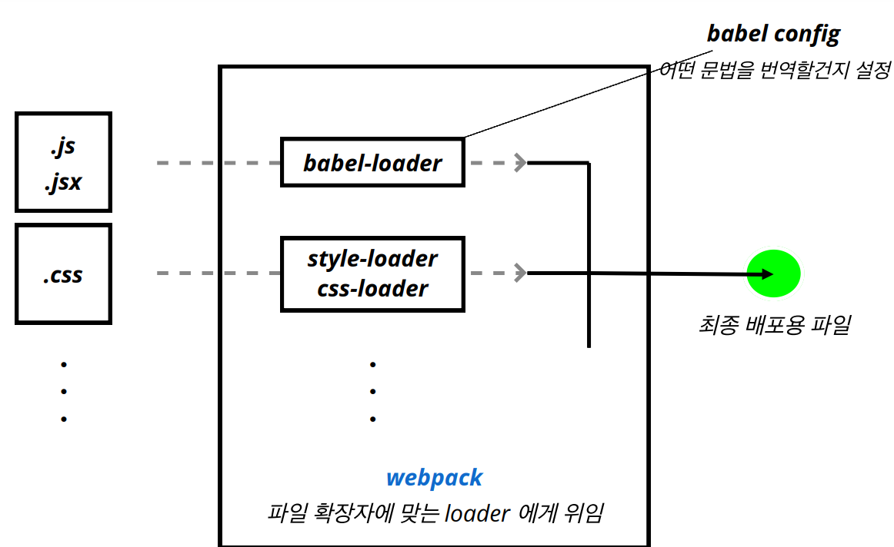

# Styled Loaders



# CSS moudle, SASS module

## classnames

```bash
npm i classnames
```

```jsx
import styles from "./Button.module.css";
import React from "react";
import classNames from "classnames/bind";

const cx = classNames.bind(styles);
// 미리 bind 하면 css 모듈 키워드 나옴
console.log(cx("button", "loading"));
// Button_button__VQG2I Button_loading__g9E3-

class Button extends React.Component {
  state = {
    loading: false,
  };

  render() {
    // 함수
    // console.log(classNames("foo", "bar"));
    // console.log(classNames("foo", "bar", "baz"));

    // console.log(classNames({ foo: true }, { bar: false }));
    // console.log(
    //   classNames(null, false, "bar", undefined, 0, 1, { baz: null }, "")
    // ); // bar 1

    // console.log(classNames(styles["button"], styles["loading"]));

    const { loading } = this.state;

    return (
      <button
        onClick={this.startLoading}
        // className={
        //   this.state.loading
        //     ? `${styles["button"]} + ${styles["loading"]}`
        //     : styles["button"]
        // }

        // className={classNames(styles["button"], {
        //   loading: this.state.loading,
        //   // css 모듈 키워드가 아니라서 사용 불가
        // })}

        className={cx("button", { loading })}
        {...this.props}
      />
    );
  }

  startLoading = () => {
    this.setState({
      loading: true,
    });
    setTimeout(() => {
      this.setState({
        loading: false,
      });
    }, 1000);
  };
}

export default Button;
```

# Styled Components

```bash
npm i styled-components
```

css 문자열이기 때문에 오타가 나더라도 쉽게 판단하기 어렵다.  
단점을 극복하기 위해 플러그인을 쓰지 않는다면 어려움이 있다  
그러므로 신중하게 사용하여야 한다.

## => props를 전달받지 않았을 때

- styled.<태그>`스타일`

components/StyledButton.jsx

```jsx
import styled from "styled-components";

const StyledButton = styled.button`
  background: transparent;
  border-radius: 3px;
  border: 2px solid palevioletred;
  color: palevioletred;
  margin: 0 1em;
  padding: 0.25em 1em;
  font-size: 20px;
`; // 스타일이 적용된 html 버튼

export default StyledButton; // 컴포넌트
```

App.jsx

```jsx
import logo from "./logo.svg";
import "./App.css";
import StyledButton from "./components/StyledButton";

function App() {
  return (
    <div className="App">
      <header className="App-header">
        
        <p>
          <StyledButton>버튼</StyledButton>
        </p>
      </header>
    </div>
  );
}

export default App;
```

## => props를 전달받았을 때

- ${props => css`스타일`}
- styled(StyledButton)
- as="태그"
- as={컴포넌트}
- styled(컴포넌트)
- styled('태그') = styled.태그
- ${props => props.color || ''}

components/StyledButton.jsx

```jsx
import styled from "styled-components";
import { css } from "styled-components";

const StyledButton = styled.button`
  background: transparent;
  border-radius: 3px;
  border: 2px solid palevioletred;
  color: palevioletred;
  margin: 0 1em;
  padding: 0.25em 1em;
  font-size: 20px;

  ${(props) =>
    props.primary &&
    css`
      background: palevioletred;
      color: white;
    `}
`; // 스타일이 적용된 html 버튼

export default StyledButton; // 컴포넌트
```

components/StyleA.jsx

```jsx
import styled from "styled-components";

const StyledA = styled.a.attrs((props) => ({
  target: "_blank",
}))`
  color: ${(props) => props.color};
`;

export default StyledA;
```

App.js

```jsx
import logo from "./logo.svg";
import "./App.css";
import StyledButton from "./components/StyledButton";
import styled, { createGlobalStyle } from "styled-components";
import StyledA from "./components/StyleA";

// styled한 버튼을 다시 styled함
const PrimaryStyledButton = styled(StyledButton)`
  background: palevioletred;
  color: white;
`;

const UppercaseButton = (props) => (
  <button {...props} children={props.children.toUpperCase()} />
);

const MyButton = (props) => (
  <button className={props.className} children={`MyButton ${props.children}`} />
);
// styled 컴포넌트가 element에 className을 추가해주고 있는 것
// 컴포넌트를 통해서 다시 element에 전달하는 작업을 해주는 것

const StyledMyButton = styled(MyButton)`
  background: transparent;
  border-radius: 3px;
  border: 2px solid ${(props) => props.color || "palevioletred"};
  color: ${(props) => props.color || "palevioletred"};
  margin: 0 1em;
  padding: 0.25em 1em;
  font-size: 20px;

  :hover {
    border: 2px solid red;
  }

  ::before {
    content: "@";
  }
`;

// 전역
const GlobalStyle = createGlobalStyle`
  button{
    color: yellow;
  }
`;

function App() {
  return (
    <div className="App">
      <GlobalStyle />
      <header className="App-header">
        
        <p>
          <StyledButton>버튼</StyledButton>
          <StyledButton primary>버튼</StyledButton>
          <PrimaryStyledButton>버튼</PrimaryStyledButton>
          <StyledButton as="a" herf="/">
            버튼
          </StyledButton>
          <StyledButton as={UppercaseButton}>button</StyledButton>
          <StyledMyButton>button</StyledMyButton>
          <StyledMyButton color="green">button</StyledMyButton>
          <StyledA href="https://google.com">태그</StyledA>
        </p>
      </header>
    </div>
  );
}

export default App;
```

# Ant Design

Ant Design  


```bash
npm i antd
```

index.js 파일에 전역 스타일 추가

```jsx
import "antd/dist/antd.css";
```

App.js

```jsx
import logo from "./logo.svg";
import "./App.css";
import { Calendar } from "antd";

function App() {
  return (
    <div className="App">
      <header className="App-header">
        
        <p>
          Edit <code>src/App.js</code> and save to reload.
        </p>
        <Calendar fullscreen={false} />
      </header>
    </div>
  );
}

export default App;
```

## icon

antd 패키지에 없어서, 따로 설치해줘야한다.

```bash
npm install --save @ant-design/icons
```

```jsx
import logo from "./logo.svg";
import "./App.css";
import { Calendar } from "antd";
import { GithubOutlined } from "@ant-design/icons";

function App() {
  return (
    <div className="App">
      <header className="App-header">
        
        <p>
          <GithubOutlined />
        </p>
        <Calendar fullscreen={false} />
      </header>
    </div>
  );
}

export default App;
```
