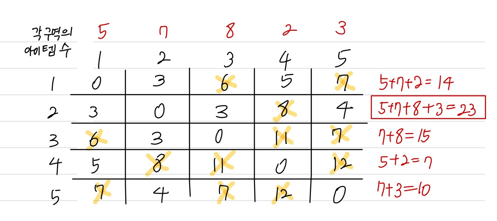

문제 링크 [https://www.acmicpc.net/problem/14938](https://www.acmicpc.net/problem/14938)

## 문제

예은이는 요즘 가장 인기가 있는 게임 서강그라운드를 즐기고 있다. 서강그라운드는 여러 지역중 하나의 지역에 낙하산을 타고 낙하하여, 그 지역에 떨어져 있는 아이템들을 이용해 서바이벌을 하는 게임이다. 서강그라운드에서 1등을 하면 보상으로 치킨을 주는데, 예은이는 단 한번도 치킨을 먹을 수가 없었다. 자신이 치킨을 못 먹는 이유는 실력 때문이 아니라 아이템 운이 없어서라고 생각한 예은이는 낙하산에서 떨어질 때 각 지역에 아이템 들이 몇 개 있는지 알려주는 프로그램을 개발을 하였지만 어디로 낙하해야 자신의 수색 범위 내에서 가장 많은 아이템을 얻을 수 있는지 알 수 없었다.

각 지역은 일정한 길이 l (1 ≤ l ≤ 15)의 길로 다른 지역과 연결되어 있고 이 길은 양방향 통행이 가능하다. 예은이는 낙하한 지역을 중심으로 거리가 수색 범위 m (1 ≤ m ≤ 15) 이내의 모든 지역의 아이템을 습득 가능하다고 할 때, 예은이가 얻을 수 있는 아이템의 최대 개수를 알려주자.

## 입력

첫째 줄에는 지역의 개수 n (1 ≤ n ≤ 100)과 예은이의 수색범위 m (1 ≤ m ≤ 15), 길의 개수 r (1 ≤ r ≤ 100)이 주어진다.

둘째 줄에는 n개의 숫자가 차례대로 각 구역에 있는 아이템의 수 t (1 ≤ t ≤ 30)를 알려준다.

세 번째 줄부터 r+2번째 줄 까지 길 양 끝에 존재하는 지역의 번호 a, b, 그리고 길의 길이 l (1 ≤ l ≤ 15)가 주어진다.

## 출력

예은이가 얻을 수 있는 최대 아이템 개수를 출력한다.

## 풀이 과정

자신에서 자신으로 갈 수 없으니, i == j 일 때를 제외한 나머지 부분들은 무한대로 초기 설정한다. 그리고 num 배열에 각 정점에서 얻을 수 있는 아이템이 몇 개인지 입력 받는다. 플로이드 와샬을 시행했을 때, 결과는 아래 사진처럼 나오게 되는데, 여기서의 숫자들은 각 노드에서 다른 노드를 갈 때 길의 길이가 얼마인지 알려주는 숫자들이다. 수색범위가 m이니까 각 노드에서 갈 때를 비교하여 m 이상인 숫자들은 도달할 수 없는 정점이라는 뜻이니 continue로 넘어가준다.

{: width="500" height="300"}

```c++
#include <vector>
#include <algorithm>
#include <iostream>
#include <cstring>
#include <stack>
#include <queue>
#include <string>
#define _CRT_SECURE_NO_WARNINGS
#pragma warning(disable : 4996)
using namespace std;

int n, m, r, x, y, z;
int num[101];
int arr[101][101];
const int INF = 1e9;

void floyd() {
  for (int k = 1; k <= n; k++) { // 경유지
    for (int i = 1; i <= n; i++) { // 출발지점
      for (int j = 1; j <= n; j++) { // 도착지점
        if (arr[i][j] > arr[i][k] + arr[k][j]) {
            arr[i][j] = arr[i][k] + arr[k][j];
        }
      }
    }
  }
}

int main() {
  ios::sync_with_stdio(false);
  cin.tie(NULL); cout.tie(NULL);

    cin >> n >> m >> r;
    // 플로이드 와샬 초기설정
    for (int i = 1; i <= n; i++) {
    	for (int j = 1; j <= n; j++) {
    		if (i != j) arr[i][j] = INF;
    	}
    }
    for (int i = 1; i <= n; i++) cin >> num[i];
    for (int i = 0; i < r; i++) {
    	cin >> x >> y >> z;
    	arr[x][y] = z;
    	arr[y][x] = z;
    }
    floyd();

    int res = 0;
    for (int i = 1; i <= n; i++) {
    	int sum = 0;
    	for (int j = 1; j <= n; j++) {
    		if (arr[i][j] > m) continue;
    		sum += num[j];
    	}
    	res = max(res, sum);
    }
    cout << res;
}
```
