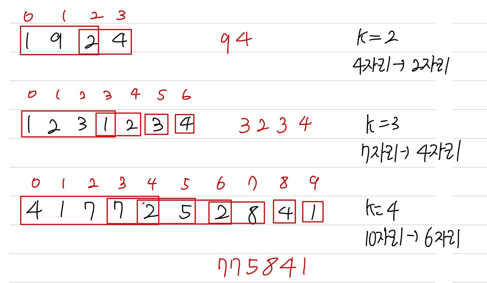

문제 링크 [https://programmers.co.kr/learn/courses/30/lessons/42883](https://programmers.co.kr/learn/courses/30/lessons/42883)

## 문제

어떤 숫자에서 k개의 수를 제거했을 때 얻을 수 있는 가장 큰 숫자를 구하려 합니다.

예를 들어, 숫자 1924에서 수 두 개를 제거하면 [19, 12, 14, 92, 94, 24] 를 만들 수 있습니다. 이 중 가장 큰 숫자는 94 입니다.

문자열 형식으로 숫자 number와 제거할 수의 개수 k가 solution 함수의 매개변수로 주어집니다. number에서 k 개의 수를 제거했을 때 만들 수 있는 수 중 가장 큰 숫자를 문자열 형태로 return 하도록 solution 함수를 완성하세요.

## 제한사항

- number는 2자리 이상, 1,000,000자리 이하인 숫자입니다.
- k는 1 이상 number의 자릿수 미만인 자연수입니다.

## 풀이 과정

그리디의 중요한 문제인 것 같다.  


```c++
#include <string>
#include <vector>

using namespace std;

string solution(string number, int k) {
    string answer = "";
    int idx = 0;
    for(int i = 0; i < number.size() - k; i++){
        int num = 0;
        for(int j = idx; j <= k + i; j++){
            if(num < number[j] - '0'){
                num = number[j] - '0';
                idx = j + 1;
            }
        }
        answer += to_string(num);
    }
    return answer;
}
```
