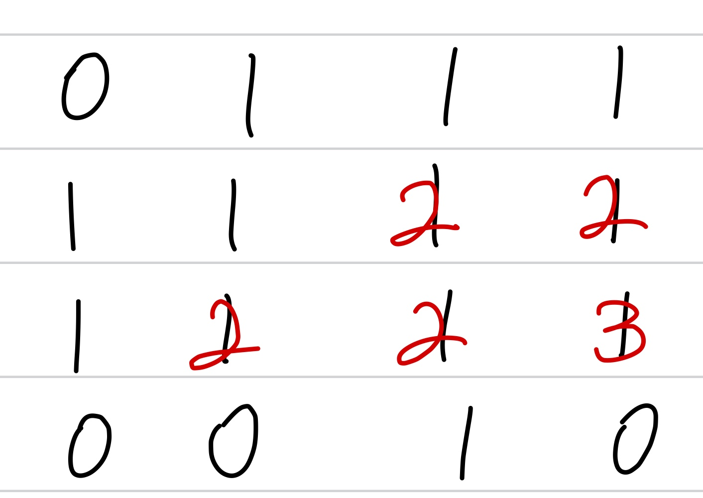

문제 링크 [https://programmers.co.kr/learn/courses/30/lessons/12905](https://programmers.co.kr/learn/courses/30/lessons/12905)

## 문제

1와 0로 채워진 표(board)가 있습니다. 표 1칸은 1 x 1 의 정사각형으로 이루어져 있습니다. 표에서 1로 이루어진 가장 큰 정사각형을 찾아 넓이를 return 하는 solution 함수를 완성해 주세요. (단, 정사각형이란 축에 평행한 정사각형을 말합니다.)

## 제한사항

- 표(board)는 2차원 배열로 주어집니다.
- 표(board)의 행(row)의 크기 : 1,000 이하의 자연수
- 표(board)의 열(column)의 크기 : 1,000 이하의 자연수
- 표(board)의 값은 1또는 0으로만 이루어져 있습니다.

## 풀이 과정

가장 큰 정사각형 문제는 오른쪽 아래의 숫자를 잘 봐야된다.  
초기값은 board 0, 0 배열의 값으로 두고, board 배열의 값이 1이 될 때  
(i - 1, j), (i, j - 1), (i - 1, j - 1) 이 중에서 가장 작은 값을 찾은 뒤 + 1를 해주면 된다.

가장 큰 값을 찾아 제곱을 해주면 답이다.

{: width="200" height="200"}

### 풀이1

```c++
#include <algorithm>
#include <vector>
using namespace std;

int solution(vector<vector<int>> board)
{
    int answer = board[0][0];
    for(int i = 1; i < board.size(); i++){
        for(int j = 1; j < board[i].size(); j++){
            if(board[i][j] == 1){
                board[i][j] = 1 + min({board[i][j - 1] , board[i - 1][j], board[i - 1][j - 1]});
                answer = max(board[i][j], answer);
            }
        }
    }
    answer *= answer;
    return answer;
}
```

### 풀이2

```c++
#include <vector>
using namespace std;

int max(int a, int b){
    return a > b ? a : b;
}
int min(int a, int b){
    return a > b ? b : a;
}
int solution(vector<vector<int>> board)
{
    int answer = board[0][0];
    for(int i = 1; i < board.size(); i++){
        for(int j = 1; j < board[i].size(); j++){
            if(board[i][j] == 1){
                board[i][j] = 1 + min(min(board[i][j - 1], board[i - 1][j]), board[i - 1][j - 1]);
                answer = max(board[i][j], answer);
            }
        }
    }
    answer *= answer;
    return answer;
}
```
