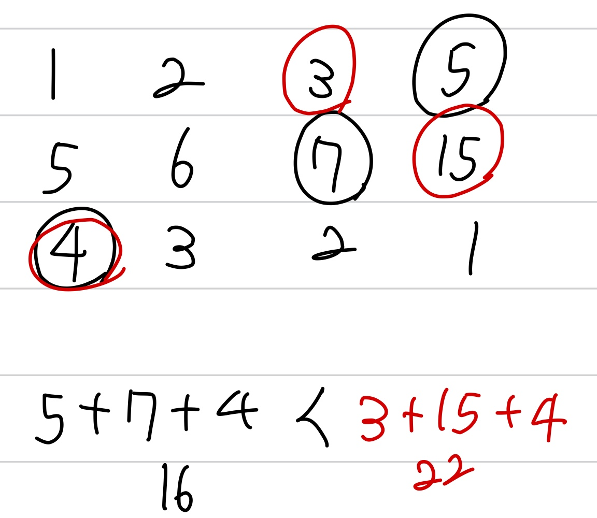

문제 링크 [https://programmers.co.kr/learn/courses/30/lessons/12913](https://programmers.co.kr/learn/courses/30/lessons/12913)

## 문제

땅따먹기 게임을 하려고 합니다. 땅따먹기 게임의 땅(land)은 총 N행 4열로 이루어져 있고, 모든 칸에는 점수가 쓰여 있습니다. 1행부터 땅을 밟으며 한 행씩 내려올 때, 각 행의 4칸 중 한 칸만 밟으면서 내려와야 합니다. 단, 땅따먹기 게임에는 한 행씩 내려올 때, 같은 열을 연속해서 밟을 수 없는 특수 규칙이 있습니다.

마지막 행까지 모두 내려왔을 때, 얻을 수 있는 점수의 최대값을 return하는 solution 함수를 완성해 주세요. 위 예의 경우, 1행의 네번째 칸 (5), 2행의 세번째 칸 (7), 3행의 첫번째 칸 (4) 땅을 밟아 16점이 최고점이 되므로 16을 return 하면 됩니다.

## 제한사항

- 행의 개수 N : 100,000 이하의 자연수
- 열의 개수는 4개이고, 땅(land)은 2차원 배열로 주어집니다.
- 점수 : 100 이하의 자연수

## 풀이 과정

처음에는 단순히 1행에서 가장 큰 값 더하고, 그 열을 제외한 2행에서 가장 큰 값 더하고...  
이런 식으로 풀었었다. 그러나, 이렇게 풀면 예외 케이스가 존재했다.

{: width="250" height="200"}

그래서 이 문제는 dp로 해결해야 한다.

0열일 때는 전 행에서 0열을 제외한 1, 2, 3열에서 가장 큰 값  
1열일 때는 전 행에서 1열을 제외한 0, 2, 3열에서 가장 큰 값  
2열일 때는 전 행에서 2열을 제외한 0, 1, 3열에서 가장 큰 값  
3열일 때는 전 행에서 3열을 제외한 0, 1, 2열에서 가장 큰 값

다 더했을 때, 마지막 행에서 가장 큰 값을 구하면 된다.

### 풀이1

```c++
#include <algorithm>
#include <vector>
using namespace std;

int solution(vector<vector<int> > land)
{
    int answer = 0;
    for(int i = 0; i < land.size() - 1; i++){
        land[i + 1][0] += max({land[i][1], land[i][2], land[i][3]});
        land[i + 1][1] += max({land[i][0], land[i][2], land[i][3]});
        land[i + 1][2] += max({land[i][0], land[i][1], land[i][3]});
        land[i + 1][3] += max({land[i][0], land[i][1], land[i][2]});
    }
    for(int i = 0; i < 4; i++){
        answer = max(answer, land[land.size() - 1][i]);
    }
    return answer;
}
```

### 풀이2

```c++
#include <vector>
using namespace std;

int max(int a, int b){
    return a > b ? a : b;
}
int solution(vector<vector<int>> land)
{
    int answer = 0;
    for(int i = 0; i < land.size() - 1; i++){
        land[i + 1][0] += max(max(land[i][1], land[i][2]), land[i][3]);
        land[i + 1][1] += max(max(land[i][0], land[i][2]), land[i][3]);
        land[i + 1][2] += max(max(land[i][0], land[i][1]), land[i][3]);
        land[i + 1][3] += max(max(land[i][0], land[i][1]), land[i][2]);
    }
    for(int i = 0; i < 4; i++){
        answer = max(answer, land[land.size() - 1][i]);
    }
    return answer;
}
```
