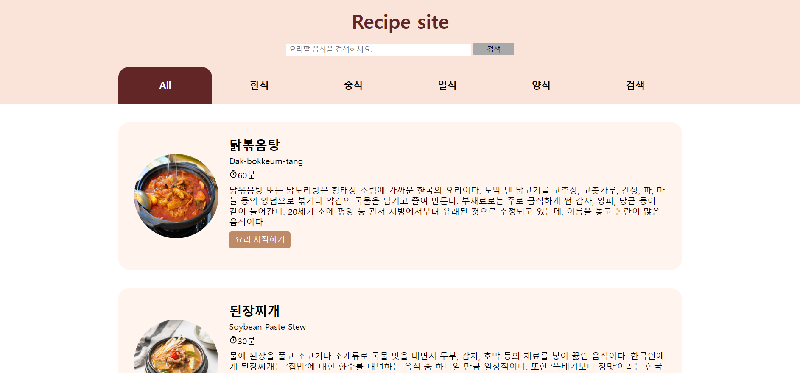
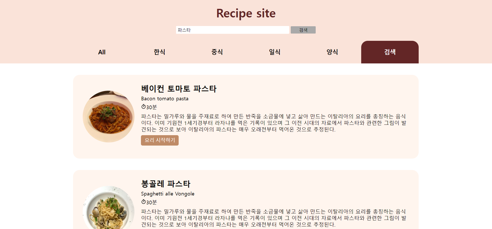
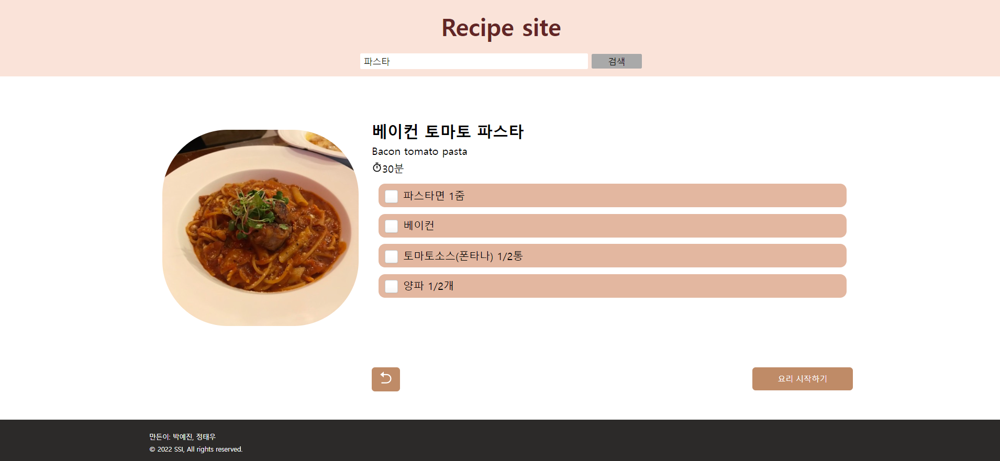
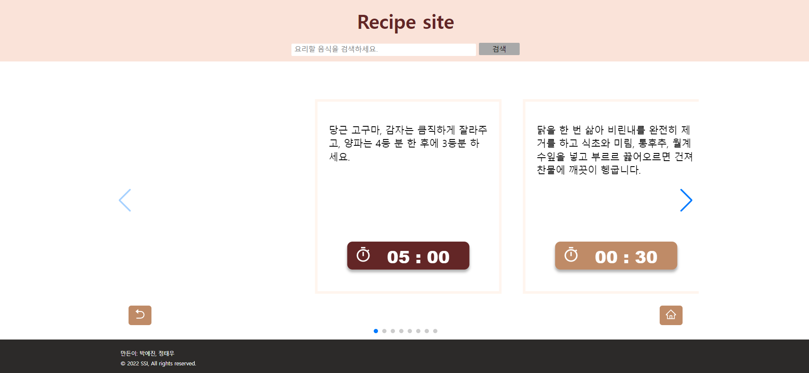

# 프로젝트 개요

레시피 사이트에 타이머가 없는 것을 불편하게 느껴 함께 배치하고자 했다.  
netlify를 활용한 배포 링크: [https://ssi-recipe.netlify.app/](https://ssi-recipe.netlify.app/){:target="\_blank"}

# 소개글

- 재료 준비했으면 체크하는 기능 구현
- 타이머 따로 챙길 필요 없이 레시피 사이트로만 해결하기









# React를 선택한 이유

1. 가장 많은 사람들이 사용하고 있는 라이브러리로 문제를 해결할 방법을 찾기가 쉽다.
2. Virtual DOM이나 JSX, Functional Programming등 기술적으로 큰 장점을 느꼈다.

## 1일차

리액트로 첫 토이 프로젝트를 진행하며 가장 어려웠던 점은 계획 짜는 과정이었다. 전체적인 틀과 부분적으로 컴포넌트를 나누면서 필요한 기능들을 나열하는 과정이 팀 프로젝트를 진행하며 가장 어려웠던 부분인 것 같다.

협업이 처음이다보니 깃허브를 사용하는 법을 잘 몰랐다. pull request나 merge하는 것들을 아예 몰라서 구글링과 유튜브를 통해 시작하며 레포지토리를 여러번 생성하여 팀원과 연습하는 과정을 겪었다. 테스트해보기 위해 레포지토리 생성과 폭파만 5개를 넘게 한 것 같다.

```bash
npm I react-router-dom
```

react-router-dom이 v6으로 업그레이드 되면서 route하는 부분과 provider하는 부분을 어떻게 연결해야 할지 잘 몰랐었다. 원래는 가장 상위 컴포넌트에 프로바이더를 하여 하위 컴포넌트에서 데이터를 가져올 수 있는 것인데 router 부분과 합쳐져 어려움을 느꼈다.

## 2일차

NavLinks routes 생성  
styled-component vs css module고민함

but styled-component 선택!

```bash
npm I styled-components
npm i styled-reset
```

filter함수를 사용해 id를 slice하여 한식, 중식, 일식, 양식 라우트를 나누었다.

totalTime 옆에 시계 모양 이모티콘  
styled-icons가 react icon에서 가장 많이 쓰이는 라이브러리라고 한다!

```bash
npm install styled-icons —save
```

## 3일차

Container같이 반복되는 styled-component는 빼기!  
리스트에 hover 스타일 추가하기  
요리 시작하기 styledButton 만들기  
디테일 부분에서 뒤로가기 버튼 react-icons로 만들기  
요리 시작하기 버튼 누르면 스크롤 바 없애기 px를 vh로 변경

## 4일차

checkbox 스타일 수정

IngredientDetail, StepDetail 컴포넌트 생성했다.  
StepDetail을 swiper로 시간이 지나면 넘어가게 하는 건 어떨까?

```bash
npm I swiper
```

- react key 줘야하는 이유?
  React는 key prop을 사용하여 컴포넌트와 DOM 요소 간의 관계를 생성한다. 리액트 라이브러리는 이 관계를 이용해 컴포넌트 리렌더링 여부를 결정한다. 불필요한 리렌더링을 방지하기 위해서는 각 자식 컴포넌트마다 독립적인 key값을 넣어줘야 한다.

- 가장 중요한 timer 부분
  setTimeout vs setInterval

  useEffect는 react hook으로 컴포넌트를 설계할 때 라이프 사이클 중 componentDidMount와 componentDidUpdate 그리고 componentWillUnmount를 아우르는 역할을 담당하고 있다.  
  타이머가 DOM에 첫 랜더링 이후 설정되고 언마운트 시 해제하기 위해 useEffect를 활용한다.  
  참고 블로그: [https://handhand.tistory.com/32](https://handhand.tistory.com/32)

-> 어려웠던 부분  
swiper initialslide 1번째로 하게 하고 싶은데 안 된다.  
활성화된 슬라이드가 가운데 배치되도록 하고 싶다  
그리고 딱 들어갔을 때 첫 번째 슬라이드가 중간에 나왔으면 좋겠다.

-> 해결 방법  
centeredSlides 파라미터를 true로 설정해주니 바로 해결됨!

## 5일차

검색 기능 구현해보기  
include, filter 함수 사용함으로써 생각보다 구현이 쉽게 됐다.
